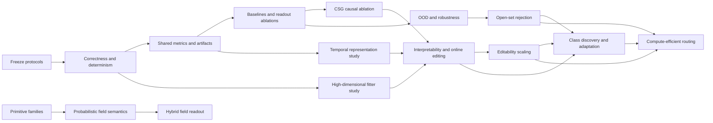
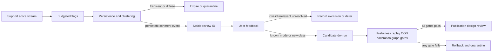

# GEODE Research Implementation Plan

Date: 2026-07-25  
Source: `analysis/RESEARCH_REPORT_v3.md`, Sections 6 and 7  
Execution environment: `.venv` on Windows, with expensive tiers run only after
toy and focused validation gates pass.

## 1. Objective

The program has two goals:

1. correct semantic, numerical, and reproducibility risks in the current
   implementation; and
2. produce causal experimental evidence for or against GEODE's proposed
   contributions.

The primary research question is:

> Does discriminative CSG excision improve held-out classification at matched
> features, model complexity, score calibration, random seeds, and compute?

The secondary questions are:

- Do ellipsoid SDF scores add useful nonlinear information beyond a linear
  readout on the same transformed features?
- Is robust constructive fitting more stable than GMM/Mahalanobis alternatives
  under outliers and label noise?
- Can a stronger causal representation make the unchanged GEODE readout useful
  for temporal learning?
- Do geometric scores provide useful OOD and selective-prediction signals?
- Can calibrated rejection distinguish known-class samples from persistent
  unseen-class structure without forcing every input into a known class?
- Can rejected samples be assigned safely to an existing class update or a new
  class/model while preserving prior capabilities?
- Does hierarchical candidate routing retain exhaustive-routing decisions while
  making online compute grow sublinearly with the number of registered classes?
- Do geometric radial scores and probabilistic density scores contain
  complementary information when evaluated through one calibration-only hybrid
  readout on identical frozen primitives?

## 2. Operating Rules

1. Use `\.venv\Scripts\python.exe` for all Python commands.
2. Never use the final test split for model, threshold, representation, or
   ablation selection.
3. Freeze split indices and feature arrays before comparing methods.
4. Use the same seed list, calibration data, and metric code for all methods.
5. Run toy tests first, one-fold smoke tests second, full five-seed experiments
   third, and Tier 5 or full Tier 6 only after all earlier gates pass.
6. Save configuration, commit hash, split hash, dataset fingerprint, timings,
   resource counts, and metrics in machine-readable JSON for every run.
7. Keep raw geometry metrics separate from calibrated-readout metrics.
8. Treat CPU-SVD and GPU-covariance construction as different method variants.
9. Do not claim a contribution when its matched ablation fails the predefined
   decision gate.
10. Preserve the SDF ellipsoid kernel; representation and calibration studies
    must remain explicit upstream and downstream variants.
11. Keep role fingerprints and empirical distribution profiles separate. A
    matching I/O contract does not imply that a sample belongs to the model's
    learned support.
12. Never create a class from one rejected sample. Require persistent clustered
    evidence, a minimum support rule, and validation-gated rollback.
13. Report throughput and memory against class, node, primitive, dimension, and
    batch axes. Do not use "unbounded" or "unlimited" scaling without a bounded
    resource model and an empirical growth curve.
14. Keep geometric construction and CSG as the task-independent primitive core.
    Treat metric, probabilistic, regression, and temporal likelihood semantics
    as explicit task adapters rather than universal replacements for that core.
15. Fit score normalization and readout parameters on calibration data only,
    record optimizer convergence, and never hide an iteration-limit warning in
    a comparative artifact.

## 3. Dependency Order



Correctness and determinism must precede multi-seed research. Shared metrics
must precede comparisons. Tier 4 is the primary development benchmark because
Tier 5 is expensive and sample-limited. Tier 5 is a confirmation benchmark,
not the iteration loop.

### Open-world architecture analysis

The current components are useful but do not yet form an open-world learning
loop:

- `ModelFingerprint` identifies a task and I/O contract for compatibility and
  swapping. It contains no fitted support statistics and cannot decide whether
  a sample is in distribution.
- `FittedModel.predict()` and network execution always return a known class.
  OOD scores and frozen-threshold utilities exist in experiment infrastructure,
  but production orchestration has no abstain/unknown result.
- `SemanticRouter` routes a textual goal to registered capabilities. It does
  not route an unknown feature vector, discover a class, or decide whether an
  existing class should be edited.
- `Orchestrator.extend()` and `ModelEditor` provide the required mutation
  mechanisms, but extension and editing are manually initiated. There is no
  rejection buffer, persistence test, cluster proposal, update-versus-create
  policy, or automatic rollback gate.
- CSG excision may sharpen known-class boundaries, but prior M4 evidence found
  no aggregate held-out benefit. Excision must therefore compete with calibrated
  probability, energy, Mahalanobis, and k-NN rejection; it cannot be assumed to
  identify unseen classes by itself.

An out-of-support sample is not necessarily a new class. It may be corruption,
covariate shift, an underfit region, or a new mode of a known class. The research
program must establish rejection, persistence, grouping, semantic assignment,
and safe mutation as separate causal claims.

### Goal pivot: support-problem flagging, not unknown classification

After M11.21, the primary open-world objective is no longer to classify an
individual observation as belonging to an unknown class. The system should
instead flag weakly supported observations under a bounded review budget,
group recurring evidence across time, and ask a user to resolve persistent
events. Before confirmation, the only admissible meanings are:

- normal prediction with no flag;
- `flagged_for_review` with novelty evidence and nearest known candidates;
- a stable `review_id` for a persistent coherent group; or
- expired/quarantined evidence that never becomes a review.

An `UNKNOWN` label remains available as an abstention mechanism, but it is not
a semantic class claim. A review may later be confirmed as a known-class mode,
a new class, invalid/corrupted data, irrelevant data, or unresolved. Only a
confirmed known/new-class response can open an adaptation dry run, and all
existing usefulness, replay, calibration, graph, and rollback gates remain in
force. User feedback authorizes evaluation, never direct mutation.

The per-point M10 gate is retained as a benchmark of standalone OOD quality and
as the stricter requirement for autonomous action. It is no longer a blocker
for review-only operation. Review-only operation receives a separate event
gate based on useful review coverage and bounded human burden.

### Evidence synthesis after M11.21

The completed milestones materially change the plan. The central bottleneck is
no longer transaction plumbing; it is reliable support estimation in the
chosen representation.

1. **Raw geometric sign is not an OOD detector.** The M10 production gate
   failed, and excluded CIFAR classes reached only 3.3% mean unknown recall in
   M11.17. M11.18 then compared ten calibrated or density-based alternatives
   using proxy classes 6/7 for development and untouched classes 8/9 for final
   transfer. Development selected maximum probability, but it reached only
   11.4% mean final recall and zero of nine cells passed. Even the best
   observational score, metric SDF, reached only 22.2% mean recall. Negative
   SDF means membership in a fitted geometric region, not calibrated evidence
   that the input belongs to the training distribution.
2. **Persistence is necessary but not semantic evidence.** Stable clusters can
   be unseen classes, shifted known classes, corruptions, or diffuse feature
   artifacts. Fixed centroid separation prevented false creation but missed a
   nearby unseen class; delayed confirmation recovered the ambiguity at a
   measurable review cost.
3. **Representation quality bounds geometric editability.** On HOG features,
   confirmed CIFAR shifts were often already handled or too diffuse for one
   exclusion-safe ellipsoid. No candidate across 39 real-feature cells passed
   both gain-headroom and geometric-coverage gates. M11.19 then showed that
   MobileNetV2 raises closed-set accuracy from 68.6% to 94.2%, neighborhood
   purity from 0.625 to 0.823, and unknown recall from 11.4% to 39.4% relative
   to HOG. Representation quality matters causally, but only one of nine cells
   passed and no representation met the frozen advance rule.
4. **Fusion semantics must match model semantics.** Normalized softmin is
   appropriate within one smooth mixture, but appending a disconnected mode
   changes its denominator and perturbs scores globally. Hard union between
   independently fitted modes removed all synthetic replay regressions while
   retaining normalized softmin within each mode.
5. **Confirmation authorizes evaluation, not mutation.** Replay, OOD,
   usefulness, calibration, graph validation, and rollback can still veto a
   confirmed action. Low confirmation-action agreement can therefore be the
   correct safety outcome.
6. **Class creation is a graph migration.** Score width, calibrator semantics,
   output fingerprints, and downstream dimensions must change atomically.
   Existing-class updates keep width fixed but can still require recalibration
   and downstream reconstruction because score distributions move.

### Prior work mapped to the observed failures

| Problem exposed here                     | Closest prior work                                                                                                                                                                                                                                                                           | What to reuse                                                                                                                | What remains GEODE-specific                                                                                                      |
| ---------------------------------------- | -------------------------------------------------------------------------------------------------------------------------------------------------------------------------------------------------------------------------------------------------------------------------------------------- | ---------------------------------------------------------------------------------------------------------------------------- | -------------------------------------------------------------------------------------------------------------------------------- |
| Open-space risk and unknown rejection    | Bendale and Boult, [NNO/open-world recognition](https://arxiv.org/abs/1412.5687); Bendale and Boult, [OpenMax](https://arxiv.org/abs/1511.06233)                                                                                                                                             | Explicit unknown mass, distance-decaying support, tail calibration, open-world evaluation                                    | Apply bounded support and tail evidence to editable ellipsoid unions and versioned support profiles                              |
| Distance-based OOD calibration           | Lee et al., [Mahalanobis OOD](https://arxiv.org/abs/1807.03888); Liu et al., [energy OOD](https://arxiv.org/abs/2010.03759)                                                                                                                                                                  | Development-only score selection, logistic calibration, energy and Mahalanobis controls                                      | Determine whether primitive-level residuals add signal beyond these matched baselines                                            |
| Distribution-free uncertainty            | Angelopoulos and Bates, [conformal prediction](https://arxiv.org/abs/2107.07511)                                                                                                                                                                                                             | Split calibration, coverage reporting, abstention sets                                                                       | Define nonconformity over class modes and support-profile versions; do not claim shift-robust guarantees without exchangeability |
| Compact support estimation               | Tax and Duin, SVDD; Schölkopf et al., one-class SVM; Chalapathy et al., [one-class neural objectives](https://arxiv.org/abs/1802.06360)                                                                                                                                                      | Minimum-volume/support objectives and explicit negative controls                                                             | Multi-ellipsoid, editable, class-conditional support with CSG and transaction audits                                             |
| Ellipsoidal mixture classification       | Hastie and Tibshirani, [Mixture Discriminant Analysis](https://doi.org/10.1111/j.2517-6161.1996.tb02085.x)                                                                                                                                                                                   | Per-class component mixtures, priors, covariance/log-determinant terms                                                       | GEODE's analytic SDF/CSG representation and local structural editing; the mixture itself is not novel                            |
| Robust multi-model fitting               | Barath and Matas, [Progressive-X](https://arxiv.org/abs/1906.02290); Zhao et al., [robust EM ellipsoid fitting](https://arxiv.org/abs/2110.13337)                                                                                                                                            | Progressive proposal/rejection/consolidation, principled stopping, robust weighted fitting                                   | Couple fit acceptance to classification replay, OOD, and graph-level safety gates                                                |
| Incremental classes and forgetting       | Rebuffi et al., [iCaRL](https://arxiv.org/abs/1611.07725); Lopez-Paz and Ranzato, [GEM](https://arxiv.org/abs/1706.08840); Buzzega et al., [DER](https://arxiv.org/abs/2004.07211)                                                                                                           | Bounded exemplar replay, no-forgetting constraints, preservation of historical outputs                                       | Structural rather than gradient updates, exact snapshots, and local changed-region certificates                                  |
| Sparse expert routing                    | Jacobs et al., adaptive mixtures of experts; Shazeer et al., sparse MoE; Switch Transformers                                                                                                                                                                                                 | Candidate routing, load controls, sparse execution                                                                           | Deterministic geometric bounds and auditable candidate omission rather than learned gates                                        |
| Buffered stream novelty discovery        | Spinosa et al., [cluster-based novel concept detection](https://doi.org/10.1145/1363686.1363912); Masud et al., [novel classes under time constraints](https://doi.org/10.1109/TKDE.2010.61); de Faria et al., [MINAS](https://doi.org/10.1007/s10618-015-0433-y)                            | Buffer unsupported observations, separate novelty from known-class extension, promote persistent clusters, handle recurrence | Versioned support profiles, stable review provenance, and confirmation-gated graph transactions                                  |
| Evolving density and unknown group count | Cao et al., [DenStream](https://doi.org/10.1137/1.9781611972764.29); Campello et al., [HDBSCAN](https://doi.org/10.1145/2733381); Sarfraz et al., [FINCH](https://arxiv.org/abs/1902.11266)                                                                                                  | Fading micro-clusters, noise handling, variable-density hierarchies, and cluster-count-free partitions                       | Select and validate a partition without final labels while preserving review-ID continuity                                       |
| Novel and generalized category discovery | Han et al., [Deep Transfer Clustering](https://arxiv.org/abs/1908.09884) and [AutoNovel](https://arxiv.org/abs/2002.05714); Vaze et al., [GCD](https://arxiv.org/abs/2201.02609); Fini et al., [UNO](https://arxiv.org/abs/2108.08536); Cao et al., [ORCA](https://arxiv.org/abs/2102.03526) | Joint known/unlabeled representation learning, reduced seen-class bias, pseudo-labeling, and class-count estimation          | Keep discovery label-blind online, isolate representation migration, and require transaction safety after human confirmation     |
| Semantic clustering and user feedback    | Caron et al., [DeepCluster](https://arxiv.org/abs/1807.05520); Van Gansbeke et al., [SCAN](https://arxiv.org/abs/2005.12320); Van Craenendonck et al., [COBRAS](https://doi.org/10.1007/978-3-030-01768-2_29)                                                                                | Learn clustering-suitable features and convert sparse must-link/cannot-link answers into partition constraints               | Attach feedback to immutable samples and stable review groups without treating names as autonomous class evidence                |

This mapping narrows the novelty claim. Ellipsoids, mixture classification,
distance-based OOD, replay, buffering rejected observations, stream novelty
discovery, clustering, and CSG each have substantial prior art. They must be
baselines or borrowed mechanisms, not independent GEODE contributions. In
particular, automatic partitioning of accumulated unknown observations is not
itself novel. The potentially distinctive claim is the integration of that
lifecycle with versioned support profiles, editable ellipsoid graphs, stable
review provenance, and transactional adaptation and rollback.

### Revised fixes and improvements

#### Priority 0: establish budgeted event-level review

No real candidate transaction should resume until user confirmation and the
unchanged transaction gates pass.

1. Treat maximum probability and other support scores as flag-ranking signals,
   not semantic unknown probabilities.
2. Select fixed flag budgets on development only and report flags per 1,000
   observations, known-event review rate, and score rank quality.
3. Cluster flagged embeddings without labels and require support and recurrence
   across multiple windows before creating a stable review ID.
4. Present representative, boundary, and nearest-known evidence once per review
   group; suppress duplicate reviews until the group materially changes.
5. Evaluate event recall, useful-review precision, time to review, duplicate
   review rate, review burden, cluster purity, and the fraction of transient
   flags that expire without user interruption.
6. Retain the M10 90%/50% per-point gate only for autonomous unknown decisions.

#### Priority 0A: establish automatic-grouping baselines

Separate clustering, representation, and streaming-memory changes so each
result remains attributable.

1. Add FINCH as the first frozen-embedding baseline because it requires neither
   a supplied group count nor a DBSCAN radius. Select its hierarchy level using
   proxy development classes only.
2. Compare complete-buffer DBSCAN, HDBSCAN, and FINCH under identical flags,
   embeddings, labels-hidden clustering, and noise-inclusive metrics.
3. Add a DenStream-style fading micro-cluster memory and a MINAS-style lifecycle
   that distinguishes a new group from a known-class extension. Keep both as
   review proposals, not autonomous semantic classes.
4. Estimate group count on proxy development data using Deep Transfer
   Clustering/GCD-style held-out known classes as probes; freeze the estimator
   before final unknown classes are opened.
5. Test one joint known-plus-unlabeled self-supervised representation control,
   motivated by AutoNovel, SCAN, UNO, GCD, and ORCA. Version it as a new feature
   model and never silently update the production representation.
6. After a user names, merges, or splits a group, store pairwise must-link and
   cannot-link constraints and compare a COBRAS-style refinement against
   unconstrained reclustering.

**M11.34 status:** steps 1 through 6 are complete. Direct proxy-feedback
split/merge refinement improved ARI from 0.251 to 0.273, purity from 90.0% to
91.0%, and duplicate review rate from 74.9% to 70.9%. It required about 338
pair constraints per cell and final classes remained unconstrained. The result
validates assisted refinement but not practical query efficiency or autonomous
final improvement. Proceed to a sparse active-query budget study; do not derive
constraints from final labels.

**M11.35 status:** an eight-query answer-blind active policy recovered 65.6% of
the dense ARI gain while using 42 times fewer queries. It improved ARI from
0.2511 to 0.2654 and duplicate rate from 74.95% to 73.11%, outperforming the
matched random-eight control on both metrics. Dense feedback remains the
absolute duplicate-suppression upper bound. Retain active eight for assisted
review experiments only and next test missing, incorrect, and contradictory
feedback; final labels remain observational.

**M11.36 status:** missing 25% or 50% of active-query answers retained proxy ARI
of 0.2636 or 0.2628, but one flipped answer reduced ARI to 0.2393, below the
0.2511 no-feedback baseline. Graph validation quarantined 100% of batches with
explicit opposite answers but could not detect isolated wrong answers that
remained internally consistent. Keep persistence disabled and test independent
confirmation or adjudication before accepting sparse constraints.

**M11.37 status:** two-answer agreement accepted six of eight constraints with
no harmful acceptances at 12.5% respondent error and retained ARI of 0.2656.
At 25% error it accepted 4.67 constraints, but double errors survived in 33.3%
of cells and ARI fell to the 0.251 no-feedback baseline. Confirmation mitigates
single-answer errors at twice the response burden but does not yet support
persistence. Quantify this result over repeated corruption draws next.

**M11.38 status:** 450 paired observations per error rate showed positive mean
confirmed ARI deltas through 25% answer error, but the fifth-percentile delta
was -0.0113 at 12.5% error and -0.0229 at 25%. Harmful acceptance reached 10.4%
and 37.8%, and even clean feedback showed lower-tail purity and duplicate
regressions. The predeclared persistence gate failed. Keep all constraints
ephemeral and stop expanding feedback policy until autonomous grouping improves.

**M11.39 status:** fixed ImageNet ResNet-18 reduced proxy review burden but
degraded distinct-group recall from 100% to 83.3%, ARI from 0.2511 to 0.1995,
and purity from 90.0% to 85.1%. It failed the proxy gate, and untouched final
metrics did not reverse the decision. Retain MobileNetV2 and close M11 with a
consolidated gate audit before beginning M12 cost curves.

**M11.40 status:** the executable audit passed all M11.29-M11.39 artifact
boundaries. M11 closes with M11.29 retained for automatic grouping, assisted
feedback analysis-only, and no constraint persistence, semantic class creation,
representation replacement, or mutation. The seven existing routing counters
and exhaustive exact-SDF decisions are frozen as the M12 baseline.

**M12.0 status:** all exhaustive counter formulas passed. Median latency scaled
with slope 1.003 in classes and 1.008 in primitives per class, matching the
exact operation-count slopes of 1.0. At 64 classes and batch 64, p50 latency was
1.454 ms and throughput was about 44,020 samples/s on the recorded CPU runtime.
Proceed to conservative geometric shortlisting; retain exhaustive decisions as
the authority.

**M12.1 status:** conservative support-sphere routing achieved 100% exhaustive
agreement, zero winning-score error, and candidate-count slope 0.417 through
256 classes. It evaluated only 6.56% of candidates at 256 classes, but the
per-sample Python path was about 10 times slower than vectorized exhaustive
scoring. The structural gate passes; the latency gate fails. Optimize batching
without relaxing the exact certificate.

**M12.2 status:** round-batched routing preserved exactness and accelerated the
scalar shortlist by up to 19.4 times, but it never beat exhaustive routing and
its latency slope was 1.180. Repeated class calls across rounds dominate. Test a
class-major schedule with at most one exact call per class before approximation.

**M12.3 status:** class-major routing preserved 100% agreement across four axes,
but candidate slope rose to 0.924 and no condition beat exhaustive latency. Its
maximum speed ratio was 0.87. Exact support-bound scheduling is not a latency
solution in the measured CPU implementation. Proceed to indexed top-k proposals
only with conservative omitted-bound fallback.

**M12.4 status:** nearest-centroid top-k proposals plus conservative omitted
bounds preserved exact decisions, but fallback was effectively universal.
Candidate-count slopes were 1.000-1.007 and no condition beat exhaustive
latency; maximum speed ratio was 0.564. Do not bind this router. Shift the M12
focus from class shortlisting to bounded per-class expert and primitive growth.

**M12.5 status:** calibration-gated primitive pruning reduced model size and
improved latency, but worst-seed held-out agreement was 92.2-95.7%, below the
99% gate. Maximum held-out score drift was 0.454-1.073. No budget is accepted.
Independent confirmation must participate in each removal decision.

**M12.6 status:** independent confirmation raised the smallest-model lower-tail
agreement to 98.93%, but no condition passed 99% final agreement. Larger growth
conditions remained at 94.43-96.68%. Compression remains unbound. Proceed to a
formal M12 exit audit; do not advance rejected toy policies to real features.

**M12.7 status:** complete with a negative exit gate. Instrumentation, counter
invariants, sublinear scalar candidate growth, and 100% exhaustive agreement
passed. Net latency, certified fallback, and final compression quality failed.
No candidate router or compression policy is bound, real-feature advancement is
blocked, and exhaustive exact class SDF remains authoritative over the measured
range. An efficient scalable-routing claim is not allowed.

**Decision gate:** automatic grouping advances only when it improves final
noise-inclusive ARI and distinct-group recall across disjoint final class pairs
without increasing duplicate reviews or using final labels for selection. More
data alone is not an acceptable remedy after M11.27.

#### Priority 1: test representation adequacy before geometry

The HOG result cannot distinguish a weak geometry from a representation that
does not make the proposed mode compact.

1. Freeze source-image splits, then compare HOG, cached MobileNetV2, and one
   additional fixed representation. Geometry and OOD heads receive identical
   split identities.
2. Measure class separability, local intrinsic dimension, neighborhood purity,
   proposal compactness, and baseline gain headroom before fitting experts.
3. Treat representation replacement as a versioned source-model migration. Do
   not silently refit PCA/LDA after observing a rejected proposal.
4. Advance a representation only when both OOD holdout transfer and candidate
   compactness improve against the same controls.

#### Priority 2: replace one-ellipsoid proposals with controlled multi-model fits

For candidates that have gain headroom but fail compactness, compare:

- one constrained ellipsoid;
- two to four ellipsoids selected on development data;
- Progressive-X-style propose/reject/consolidate with a complexity penalty;
- robust covariance and EMS-style fitting; and
- quarantine/no-update.

Use proposal coverage minus replay capture and a primitive cost as the
development objective. The final action still requires untouched replay/OOD
validation. More primitives are not a remedy when gain headroom is absent.

#### Priority 3: strengthen continual-learning controls

Maintain a bounded, class-balanced replay memory containing sample identity,
feature-version identity, labels when confirmed, prior raw score vectors, and
prior calibrated outputs. Compare:

- label-only exemplar replay, analogous to iCaRL;
- score preservation, analogous to DER;
- explicit no-loss constraints, analogous to GEM; and
- GEODE's exact rollback with no optimization constraint.

For structural edits, preserve both decisions and score margins. A candidate
that keeps accuracy but collapses margins or OOD separation must be rejected.

#### Priority 4: make action and migration evidence complete

Every candidate artifact should include the usefulness decision, confirmation,
fit diagnostics, replay and OOD deltas, calibration provenance, graph issues,
changed signatures, serialized before/after snapshot IDs, changed prediction
count, compute cost, and `published=false`. Publication remains a separate,
currently disabled operation.

### Novel GEODE hypotheses worth testing

These are hypotheses, not established contributions. Each needs a matched
ablation and literature review before a novelty claim.

1. **Hierarchical fusion semantics.** Use normalized softmin only within a
   coherent local expert and hard union across independently discovered modes.
   M11.12 provides causal synthetic evidence; the next test is calibrated OOD
   behavior and multi-mode complexity on real features.
2. **Counterfactual transaction certificates.** Use ellipsoid bounds and replay
   score margins to identify the region where an edit can change a decision,
   then prove unchanged decisions outside that region. This could turn replay
   validation from a sampled check into a partly analytic certificate.
3. **Geometry-aware usefulness upper bounds.** Combine baseline gain headroom,
   maximal exclusion-safe coverage, and primitive budget to bound achievable
   improvement before construction. M11.15 implements the first conservative
   bound; tighter multi-ellipsoid bounds are open.
4. **Dual support memory.** Pair immutable role fingerprints with a versioned
   support profile containing calibrated tails, routing geometry, replay
   exemplars, and feature-version provenance. This joins open-world support
   control with editable graph contracts without conflating identity and data
   distribution.
5. **Review-first open-world learning.** Preserve ambiguous persistent clusters
   under stable review IDs instead of forcing reject/update/create. Delayed
   confirmation chooses the candidate family; safety evidence chooses whether
   any action is allowed.
6. **Primitive-level open-space allocation.** Allocate rejection mass to the
   unsupported space between and beyond modes, rather than thresholding only a
   class-level score. Compare against OpenMax, energy, Mahalanobis, and k-NN;
   abandon the idea if it adds no holdout OOD signal.

### Revised execution order and stop/go gates



- **Go to user review** only after a group passes frozen support, persistence,
  compactness, and review-budget rules; no semantic decision is required.
- **Go to candidate fitting** only when gain headroom and representation-space
  compactness both pass after user confirmation.
- **Go to a multi-ellipsoid candidate** only when a one-ellipsoid candidate has
  gain headroom but fails compactness, and development evidence justifies the
  added primitive budget.
- **Go to publication design** only after replay, OOD, calibration, graph, and
  rollback tests pass across multiple stream orders. Automatic publication and
  LLM-authorized mutation remain out of scope.

---

## 4. Milestone 0: Freeze Protocols and Provenance

**Issues addressed:** 6.11, 6.13  
**Section 7 dependency:** all phases

### Deliverables

- `experiments/common/experiment_manifest.py`
  - serialize configuration, seed, commit, branch, dirty-state flag, Python and
    package versions, device, dataset fingerprint, split hash, and feature hash;
  - write one JSON record per run;
  - assign a stable experiment ID from canonical configuration JSON.
- `experiments/common/model_stats.py`
  - count experts, additive/subtractive ellipsoids, fitted parameters, empty
    classes, candidate evaluations, and approximate model bytes;
  - record fit time, inference time, samples/second, and peak process memory.
- `experiments/configs/`
  - checked-in JSON configs for Tier 4 smoke, Tier 4 full, Tier 5 confirmation,
    Tier 6 toy, and Tier 6 real runs.
- A benchmark manifest describing each tier's actual sample count, feature
  source, split policy, and metric definition.

### Metric naming corrections

- Rename the project-specific geometry `R2` display to
  `geometry_normalized_residual_score` while keeping a compatibility key for
  existing logs.
- Add Chamfer distance for point-cloud tasks.
- Add normal consistency only where normals can be estimated consistently.
- Print explicit notices that Tier 3 is digit-0 manifold fitting and Tier 4 uses
  a pretrained MobileNetV2 representation.

### Tests

- Same config produces the same experiment ID.
- A one-index split change changes the split hash.
- Model counts match hand-built toy experts.
- Manifest serialization round-trips without losing numeric types.

### Exit gate

One Tier 4 smoke run writes a complete JSON artifact and the printed summary is
reconstructable from that artifact.

---

## 5. Milestone 1: Correctness, Semantics, and Determinism

**Issues addressed:** 6.7, 6.8, 6.9, 6.10  
**Section 7 phase:** B, plus Phase A prerequisite

### 5.1 Deterministic construction

**Files:** `src/greedy_constructor.py`, `experiments/common/moe_eval.py`, Tier 4,
Tier 5, Tier 6 callers.

1. Add `seed` or `rng` to `GreedyConstructor`.
2. Store one owned `np.random.Generator`.
3. Replace every global `np.random` call in construction and subtractive fitting.
4. Make `_knn_seed` use its supplied generator.
5. Derive deterministic child seeds for class, fold, expert, and phase.
6. Keep CPU and GPU candidate streams separately reproducible.

**Tests:**

- same seed produces identical primitive parameters and predictions;
- different seeds produce at least one changed primitive on a nontrivial toy;
- class iteration order does not alter another class's random stream;
- repeated GPU candidate generation produces identical candidates.

### 5.2 Resolve pruned normalized-softmin semantics

**File:** `src/sdf_engine.py`

Adopt fixed-uniform-mixture semantics: the denominator remains total expert
count $M$ after pruning. Omitted terms affect the numerator approximation only.
Do not locally renormalize to active count $M_a$.

1. Retain the original total count in `_fuse_experts_pruned`.
2. Update the pruning error derivation and documentation.
3. Add a no-pruning reference implementation used only by tests.
4. Add four-plus separated-expert CPU tests that force pruning.
5. Add matching OpenCL parity coverage.

**Exit tolerance:** maximum CPU-pruned versus CPU-exact SDF error must satisfy a
documented bound; CPU/GPU prediction agreement must be 100% on the parity set.

### 5.3 Align CSG values and gradients

**Files:** `src/sdf_engine.py`, `src/inference_engine.py`

Choose hard CSG semantics for the current model:

- value: $\max(f_{add},-f_{sub})$;
- gradient: gradient of the active branch;
- tie policy: average the two valid branch gradients within a small absolute
  tolerance.

This preserves exact sign-level CSG and makes the returned gradient a defined
subgradient. A future smooth-CSG variant may be added as a separate named mode,
but value and gradient must use the same mode.

**Tests:** finite differences away from branch ties, explicit tie behavior, and
ray steps around subtractive boundaries.

### 5.4 Correct metric-distance claims

**Files:** `src/sdf_engine.py`, `src/inference_engine.py`, README, report.

1. Rename documentation to "signed normalized radial field" where appropriate.
2. Describe `compute_metric_sdf` as a first-order local distance estimate.
3. Remove guaranteed-safe sphere-tracing language unless a conservative bound
   is implemented.
4. Build a 2D/3D numerical closest-point reference for tests and research only.
5. Measure absolute/relative distance error by eccentricity and query direction.
6. Measure missed crossings and convergence iterations for ray tests.

**Status (2026-07-25): Complete for isolated 2D/3D ellipsoid primitives.** A
research-only numerical closest-point reference measures inside/outside error
and sampled closest-ray oversteps through eccentricity 8. Fused softmin and CSG
fields retain no exact-distance or safe-step guarantee.

### 5.5 Remove EM terminology

**Files:** `src/temporal_sampler.py`, `src/sdf_optimizer.py`, Tier 6 evaluator,
CLI, README, instructions, and tests.

Rename `em_gradient_refinement`, `n_em_iters`, `n_em_epochs`, and `em_lr` to
`supervised_refinement`, `n_refinement_iters`, `n_refinement_epochs`, and
`refinement_lr`. Support deprecated CLI aliases for one release, but emit a
warning. No persistent result schema should use `em` after migration.

**Status (2026-07-25): Complete.** Active APIs and result fields use the new
terminology. Deprecated `--em_*` CLI aliases remain for one release and emit a
warning.

### Milestone validation

```powershell
.\.venv\Scripts\python.exe -m unittest experiments.tier6.test_gpu_parity -v
.\.venv\Scripts\python.exe -m unittest experiments.tier6.test_temporal_text_prediction -v
.\.venv\Scripts\python.exe -m py_compile src\sdf_engine.py src\greedy_constructor.py src\sdf_optimizer.py src\temporal_sampler.py
```

### Exit gate

- Determinism tests pass on CPU and GPU.
- Pruned and exact normalized-softmin satisfy the stated tolerance.
- CSG finite-difference tests pass away from ties.
- No active source or documentation describes supervised refinement as EM.

---

## 6. Milestone 2: Shared Evaluation and Readout Decomposition

**Issues addressed:** 6.1, 6.2, 6.11, 6.13  
**Section 7 phase:** A

### 6.1 Shared metrics

Add `experiments/common/classification_metrics.py` with:

- accuracy and balanced accuracy;
- multiclass negative log-likelihood;
- Brier score;
- expected calibration error with fixed binning;
- Top-k accuracy;
- paired bootstrap confidence intervals;
- fit and inference timing; and
- primitive/parameter/resource counts.

Test metrics against hand-computed examples and scikit-learn where equivalents
exist.

### 6.2 Separate score readouts

Add a common readout interface with these modes:

1. `raw`: argmin of scaled SDF;
2. `temperature`: one scalar temperature on negative SDF logits;
3. `diagonal`: one monotone or affine map per class using only that class score;
4. `multinomial`: current full logistic regression over all class scores; and
5. `feature_logistic`: logistic regression directly on the transformed input.

Every classification experiment must report all applicable modes from the same
geometry and held-out calibration slice. Calibration hyperparameters must never
use the test split.

### 6.3 Result schema

Use one long-form record per `(dataset, split, seed, method, representation,
geometry_variant, readout)` with:

- point metrics and confidence intervals;
- raw and calibrated metrics;
- model complexity;
- timing and memory;
- class/sample adequacy;
- warnings and convergence state.

### Exit gate

A toy three-class model and one Tier 4 fold produce complete comparable records
for all five readout modes.

---

## 7. Milestone 3: Matched Classical Baselines

**Issue addressed:** 6.1  
**Section 7 phase:** A

### Implemented baselines

Create `experiments/common/classification_baselines.py`:

- multinomial logistic regression;
- nearest centroid;
- class-conditional single-Gaussian Mahalanobis with shrinkage;
- class-conditional Gaussian mixtures with component counts matched to GEODE;
- k-NN;
- linear SVM with calibrated probabilities;
- RBF SVM for bounded sample sizes; and
- histogram gradient boosting.

All baselines consume the same post-transform features and frozen split indices.
Do not let baseline-specific preprocessing see validation or test data.

### Development protocol

1. Use synthetic Gaussian mixtures to verify expected behavior.
2. Run one Tier 4 fold and one seed.
3. Profile runtime and cap infeasible methods explicitly.
4. Run five Tier 4 seeds only after smoke success.
5. Run Tier 5 only for methods that complete within the declared resource cap.

### Exit gate

The baseline table can be generated from saved JSON without rerunning models,
and every row has the same split hash and feature hash.

---

## 8. Milestone 4: Causal CSG and Calibration Ablations

**Issues addressed:** 6.1, 6.2, 6.5, 6.13  
**Section 7 phase:** A

### Geometry variants

Run these cumulatively on identical initial additive models:

| Variant | Additive fit | Standard excision | Active repair |
| ------- | -----------: | ----------------: | ------------: |
| A0      |          yes |                no |            no |
| A1      |          yes |               yes |            no |
| A2      |          yes |               yes |           yes |

For each variant, evaluate raw, temperature, diagonal, and multinomial readouts.
Include direct feature logistic regression as a non-geometric control.

### Held-out carve acceptance

Split training data into geometry-fit, carve-acceptance, and score-calibration
subsets. For each candidate subtractive primitive:

1. compute recovered false positives on carve acceptance data;
2. compute newly damaged true positives;
3. calculate balanced-accuracy or log-loss gain;
4. subtract an MDL penalty proportional to added parameters; and
5. accept only when penalized gain exceeds a configured threshold.

Store a per-carve audit trail with recovered/damaged counts and validation gain.

### Statistical protocol

- Seeds: `[11, 23, 37, 53, 71]`.
- Freeze feature and split hashes.
- Use paired bootstrap intervals for A1-A0 and A2-A1 test predictions.
- Report per-class effects, not only aggregate accuracy.
- Correct for multiple primary comparisons or predeclare one primary metric.

### Decision gate

Continue presenting CSG excision as an empirical contribution only if A1
improves the predeclared held-out metric over A0 with a confidence interval that
excludes zero, without an unacceptable complexity increase. Present active
repair separately and retain it only if A2 improves over A1.

---

## 9. Milestone 5: High-Dimensional Fitter Study

**Issue addressed:** 6.6  
**Section 7 phases:** B and D

### Candidate fitters

Define a common candidate-fitter protocol and compare:

1. current CPU SVD with covariance fallback;
2. current GPU batched covariance;
3. diagonal covariance;
4. shrinkage covariance;
5. Minimum Covariance Determinant where sample size permits;
6. low-rank-plus-diagonal precision;
7. GMM initialization converted to ellipsoids; and
8. EMS-style robust fitting as a later research implementation.

### Synthetic benchmark

Generate known mixtures over dimensions 3, 6, 9, 12, and 19 with controlled:

- class overlap;
- outlier rate;
- label noise;
- anisotropy;
- component count; and
- samples per class.

Measure parameter recovery, held-out classification, candidate success rate,
fit time, memory, and sensitivity to seeds. Match both candidate count and
wall-clock budget in separate comparisons.

### Production confirmation

Use Tier 4 to select at most two promising fitters. Confirm only those on Tier 5
with one smoke seed, then five seeds if runtime and accuracy justify it.

### Exit gate

Adopt a new default only if it improves the accuracy/runtime/robustness frontier
and passes the same deterministic and GPU parity requirements.

---

## 10. Milestone 6: Temporal Representation and Refinement

**Issues addressed:** 6.3, 6.4  
**Section 7 phase:** C

### 10.1 Rename and isolate representation variants

Expose a common `SequentialRepresentation` interface that maps an ordered
observation stream to causal fixed-width states. Implement:

- exact character window;
- current single reservoir;
- hybrid exact-window plus reservoir;
- multi-seed reservoir ensemble;
- multi-timescale leaky reservoirs;
- hashed explicit n-gram features;
- frozen pretrained sequence embeddings; and
- later, a small trained GRU control.

The same representation output must feed both GEODE and linear readouts.

### 10.2 Fair baseline budgets

Report two n-gram comparisons:

- **matched-data:** n-gram counts use the same number and locations of training
  characters as GEODE;
- **best-practical:** n-gram uses the current larger corpus budget.

Also report feature-logistic and a small GRU on the same chronological split.

### 10.3 Staged temporal experiments

1. Periodic and variable-order synthetic languages.
2. A 100k-character WikiText slice with small sample counts.
3. One fixed 50k/10k real smoke experiment.
4. Forward-validation tuning of state dimension, exact window, recurrence,
   leak rates, and reservoir seeds.
5. Lock the representation configuration.
6. Run the final test once.

### 10.4 Geometry mechanism matrix

On the locked representation, compare:

- initial additive geometry;
- one bounded supervised refinement iteration;
- two bounded refinement iterations;
- held-out-accepted subtractive geometry without refinement; and
- recalibrated readouts after every geometry mutation.

Do not combine subtractive geometry with `SDFOptimizer` until subtractive
derivatives are implemented and independently tested.

### Decision gate

Describe Tier 6 as competitive temporal learning only if GEODE approaches the
matched-data n-gram baseline and improves over feature logistic regression on
forward validation and final test. Otherwise retain it as an architecture
flexibility demonstration and report the negative result.

---

## 11. Milestone 7: OOD, Calibration, and Selective Prediction

**Issue addressed:** 6.12  
**Section 7 phase:** D

### In-distribution protocol

Use CIFAR-10 as in-distribution with untouched train, calibration, validation,
and test partitions. Never tune OOD thresholds on the final OOD test sets.

### OOD datasets

- SVHN;
- CIFAR-100;
- LSUN or Places subset;
- Describable Textures; and
- synthetic feature-space outliers for controlled distance analysis.

### Scores

- minimum raw class SDF;
- minimum first-order metric-corrected score;
- maximum calibrated probability;
- energy over class SDFs;
- single-Gaussian Mahalanobis;
- GMM likelihood; and
- k-NN feature distance.

### Metrics

- AUROC;
- AUPR-in and AUPR-out;
- FPR95;
- ECE and Brier score in distribution;
- risk-coverage and accuracy-rejection curves; and
- conformal set coverage and average set size.

### Exit gate

Make uncertainty or OOD claims only for scores that improve over matched
Mahalanobis and k-NN baselines across more than one OOD family.

---

## 12. Milestone 8: Robustness, Interpretability, and Online Editing

**Issues addressed:** 6.6, 6.13  
**Section 7 phase:** D

### 12.1 Robustness experiments

Inject controlled corruption into training data:

- symmetric label noise at 5%, 10%, and 20%;
- class-conditional label noise;
- feature outliers at increasing distance;
- missing dimensions; and
- covariance shift.

Compare GEODE, GMM/MDA, Mahalanobis, SVM, boosting, and k-NN. The primary
hypothesis is that RANSAC construction degrades more gracefully under outliers.

### 12.2 Primitive stability

Across five seeds, match ellipsoids by center/covariance distance and report:

- component-count variance;
- matched-center and precision drift;
- carve-region overlap;
- prediction agreement; and
- feature-space visualizations for selected classes.

### 12.3 Online operations

Define and test:

- insertion of a new additive primitive from new data;
- insertion of a validated subtractive carve;
- deletion of one primitive with cache invalidation;
- local nudge/refinement without rebuilding unrelated classes; and
- rollback from a serialized model snapshot.

Measure edit latency, affected predictions, and whether untouched classes remain
bitwise stable.

### Exit gate

Claim editability only after insertion, deletion, and rollback are covered by
behavioral tests and produce localized, auditable prediction changes.

---

## 13. Milestone 9: Editability Scaling

**Issues addressed:** 6.13, open-world resource growth  
**Status:** complete; focused tests, maximum-axis smoke, and locked five-repeat
execution passed

Run the locked one-factor-at-a-time study already defined in
`experiments/configs/tier5_editability_scaling.json`. Vary class count,
dimension, and primitives per class independently. Record:

- insertion, deletion, local nudge, rollback, and cache-invalidation latency;
- exhaustive inference latency and throughput;
- canonical serialized bytes and insertion growth;
- changed predictions and exact untouched-class SDF stability; and
- target-class and full-model deterministic reconstruction time.

The reconstruction controls are not optimizer retraining. M9 establishes local
operation scaling only; it cannot establish open-world routing or class
discovery.

### Exit gate

All locality and rollback checks must pass at every scale. Report empirical
growth curves and failure points without extrapolating beyond measured ranges.

All gates passed through 128 classes, 128 dimensions, and 128 primitives per
class. Local point-fitted insertion remained below 0.18 ms median. Exhaustive
inference reached 15.89 ms at 128 classes and 14.81 ms at 128 primitives per
class. Dense 128-dimensional orientation state was the strongest storage/edit
bottleneck: 4.32 MiB for 64 primitives, 99.36 ms rollback, and 102.15 ms local
nudge. These are measured synthetic CPU operating points, not general limits.

---

## 14. Milestone 10: Calibrated Open-Set Inference

**Issues addressed:** closed-set forced assignment, orphaned OOD infrastructure  
**Section 7 phase:** E  
**Status:** contracts, opt-in inference, counters, and one toy episode complete;
multi-episode validation pending

### 14.1 Separate identity from learned support

Keep `ModelFingerprint` as the immutable role/I/O contract. Add a separately
versioned empirical support profile containing:

- model signature and exact feature-transform fingerprint;
- training and calibration dataset fingerprints;
- ordered class IDs and score scales;
- selected novelty score and frozen per-model or per-class thresholds;
- compact candidate-routing keys such as class centroids and conservative
  bounding radii; and
- profile version, fit seed, and creation time.

Do not silently call this a model fingerprint. Compatibility identity and data
support answer different questions and have different update lifecycles.

### 14.2 Abstaining inference contract

Add a production result type that returns, per sample:

- accepted known label or explicit `UNKNOWN`;
- candidate model and class IDs;
- raw and calibrated novelty scores;
- frozen threshold and decision margin;
- support-profile version; and
- reason code such as accepted, low confidence, outside support, or no
  compatible candidate.

The existing closed-set `predict()` API remains available. Open-set behavior
must be opt-in until equivalence tests and threshold protocols pass.

### 14.3 Evaluation protocol

Use leave-class-out episodes. In each episode, fit geometry and thresholds on
known-class training/calibration data, use designated proxy-unknown validation
classes only for declared score selection, and reserve different unseen classes
for final observation. Include near-OOD held-out classes, far-OOD data,
corruptions, and shifted examples from known classes.

Compare:

- minimum raw and metric-corrected SDF;
- SDF energy;
- maximum calibrated probability;
- Mahalanobis, GMM likelihood, and k-NN distance;
- additive-only versus CSG class models; and
- global versus per-class thresholds.

Report AUROC, AUPR, FPR95, open-set classification rate, known-class accuracy at
fixed unknown recall, unknown precision/recall, risk-coverage, and latency. Add
OSCR if its implementation is verified against a reference calculation.

### Exit gate

No open-set routing claim until frozen thresholds reject unseen classes across
multiple leave-class-out episodes while preserving declared known-class
coverage. CSG is retained for rejection only if it improves over additive GEODE
and matched non-geometric scores at comparable compute.

The first six-class toy episode selected Mahalanobis on proxy class 3, but its
frozen threshold rejected only 2.5% of final unknown classes 4-5. k-NN rejected
3.75%; minimum SDF transferred better at 36.25% while retaining 99.17% known
coverage, but remained inadequate for an open-set claim. This confirms that
proxy-class score selection does not guarantee threshold transfer and motivates
the required multi-episode study.

The locked three-episode study completed the declared toy matrix over raw and
metric-corrected SDF, SDF energy, maximum probability, Mahalanobis, GMM, and
k-NN scores; global and per-class thresholds; and matched additive and
validation-gated CSG geometry. Proxy and final unknown class pools were globally
disjoint. No configuration preserved 90% known coverage and 50% unknown recall
in every episode. Known-coverage-constrained metric SDF was the strongest
global operating point, but its minimum test coverage was 88.3% and minimum
unknown recall was 27.5%. Validation accepted no subtractive carve, making CSG
a clean null intervention. M10 therefore remains experimental and no production
support profile is bound from this study.

---

## 15. Milestone 11: Persistent Support-Problem Review and Safe Adaptation

**Issues addressed:** no rejection buffer, no discovery policy, manual-only
extension, ambiguous update-versus-create decision  
**Section 7 phase:** E

### 15.1 Streaming benchmark

Create deterministic review streams with four event types:

1. known-class samples;
2. shifted or corrupted known-class samples;
3. a new mode of an existing class; and
4. samples from a genuinely unseen class.

Labels may be delayed for evaluation, but flagging and grouping logic cannot
inspect them. Use an oracle or human confirmation step before assigning any
semantic meaning. In review-only operation, unsupervised groups receive stable
review IDs, never temporary class identities.

### 15.2 Rejection buffer and proposals

Buffer flagged embeddings with timestamps, source model/profile versions,
support scores, flag-budget provenance, and nearest candidates. Generate a
review only when a cluster meets predeclared support, persistence, and
compactness criteria across more than one time window. Separation from known
classes is useful review evidence but is not required to ask a user. Compare
DBSCAN-style density clustering, incremental centroid clustering, and a
no-clustering flag baseline.

### 15.3 Update-versus-create policy

Evaluate three actions on a proposal:

- **quarantine:** retain `UNKNOWN` and collect more evidence;
- **update existing:** insert/nudge or reconstruct only the best existing class;
- **create new:** add a class or independent model node after confirmation.

Choose among actions using calibration/replay data only. Require improvement on
the proposal set, bounded regression on replayed known classes, preserved OOD
coverage, and transactional rollback on rejection.

Adding a class to an existing `FittedModel` changes score width, calibrator
semantics, `OutputSpec`, fingerprint signature, and downstream input dimensions.
Treat this as a versioned graph migration, not a primitive edit. Compare it with
adding an independent source node, which avoids downstream width changes but
increases routing cost. Validate the complete dependency graph atomically before
publishing either mutation.

### 15.4 Ontology-LLM semantic proposal layer

Reuse the existing small ontology LLM only after calibrated rejection and
persistent clustering. It may consume structured cluster evidence such as:

- representative captions or user-provided metadata;
- nearest known class names and ontology ancestors;
- cluster size, persistence, compactness, and novelty-score summaries; and
- source task, model signature, and compatible model families.

The LLM may propose a temporary name, ontology parents, candidate existing
classes, and one of quarantine/update/create for validation. It must not decide
whether a raw embedding is OOD, fit thresholds, mutate a model, or assign a
permanent semantic identity without oracle or user confirmation. Raw feature
vectors alone are not meaningful LLM evidence.

Persist the prompt template, model/version, generation parameters, structured
response, repair status, latency, and token counts. Require schema validation,
an explicit `UNKNOWN`/abstain response, cache by cluster-evidence fingerprint,
and deterministic non-LLM fallback. Treat LLM output as an auditable proposal,
not statistical confidence.

### Metrics and controls

Report event recall, useful-review precision, cluster purity and adjusted Rand
index, time-to-review, flags and reviews per 1,000 observations, duplicate
review rate, expired-flag fraction, update/create decision accuracy, post-update
routing accuracy, known-class forgetting, model growth, rollback rate, labeled
confirmations required, and cumulative compute. Controls include
always-update, always-create, periodic full rebuild, oracle routing, no-LLM
cluster IDs, nearest-ontology lookup, and shuffled or withheld semantic context.
For the LLM layer also report proposal accuracy, false update/create proposals,
ontology-link precision, abstention rate, confirmation burden, cache hit rate,
latency, and token/energy cost.

### Exit gate

Claim useful review triage only if persistent support problems are surfaced at
a predeclared event-recall and review-burden operating point across multiple
stream orders. Claim continual class discovery only after user-confirmed new
classes are separated from known-class shift with low false growth and accepted
updates preserve the declared replay and OOD gates.

The first M11 foundation slice is implemented. A bounded FIFO stores only
rejected embeddings and records timestamps, windows, model/profile versions,
novelty evidence, and nearest candidates. A deterministic four-event stream
keeps delayed oracle labels outside observable discovery inputs. A pure proposal
gate requires predeclared support, at least two windows, compactness, known-class
separation, and one source profile before emitting a stable temporary unknown
ID. It cannot cluster inputs, assign semantics, mutate a model, or create a
class.

The controlled clustering comparison is also complete. On five development
streams, the initial DBSCAN policy averaged 50.7% discovery precision and 76.7%
recall with four false proposals; incremental centroids averaged 68.6% precision
and 29.2% recall with two false proposals. False growth came primarily from new
modes of existing classes. A leakage-controlled separation sweep used only
those development streams, then froze thresholds before five disjoint holdout
streams. DBSCAN selected separation 2.5 and achieved 100% precision, 99.2% mean
recall, 95.8% minimum recall, and zero false proposals on holdout; all proposals
required at least two windows. This is positive synthetic policy-transfer
evidence, not authorization for model mutation. Adaptation, permanent naming,
class creation, and LLM proposals remain disabled pending broader stream
families.

The first replay-gated action iteration is complete on isolated nearest-mode
surrogates. Across five seeds, seven oracle-confirmed proposals produced two
update and five create decisions; all matched confirmation and passed the
declared proposal-gain, known-replay, OOD-recall, and transaction gates. The
always-update and always-create controls reached 28.6% and 71.4% action
accuracy, and every gated action required confirmation. No candidate was
published. This validates policy plumbing only; transactional GEODE edits and
versioned graph migration remain the next implementation step.

Transactional GEODE dry runs are now implemented. Existing-class candidates
use exact snapshot rollback, while confirmed new classes change output width,
fingerprint signature, and candidate graph state only on a deep-copied network.
Across five seeds, five create candidates preserved replay accuracy and OOD
recall and passed migration validation. Two update candidates were quarantined
after replay accuracy fell by 10-15 percentage points; one also failed proposal
gain. No candidate was published. Remaining work is explicit calibrator
refitting, reconstruction of nontrivial downstream nodes, and broader stream
validation before any publication path can be considered.

The calibrated migration mechanism is now exercised over five seeds. Each dry
run refits the expanded source calibrator on calibration-only data,
reconstructs a direct downstream node in the new score space, refits its
calibrator, validates the copied graph, and executes it end to end. All five
deliberately separable toy migrations passed while the live graphs remained
unchanged. This resolves the mechanical width/calibrator migration contract;
broader stream and real-feature evidence remain required.

Frozen-policy stream-family validation is now complete. Without retuning the
selected 2.5 separation threshold or any clustering/proposal parameter, the
policy produced zero false proposals over heavy-tailed, anisotropic,
abrupt-drift, and intermittent-unseen streams. It nevertheless missed the same
seed in every family because that unseen centroid was only 2.34 units from a
known centroid. Mean recall fell to 73.8-79.2% and minimum recall to zero. This
negative transfer result rules out automatic creation under the current
distance-only disambiguation contract; the next research step needs additional
non-geometric evidence while preserving confirmation and replay/OOD gates.

Separation-only clusters now enter a stable, non-actionable review queue rather
than disappearing or weakening the frozen proposal gate. On the 20 harder
family/seed runs, review plus proposal coverage raised mean unseen recall to
92.5-97.5% while introducing 9-11 reviews per family. Delayed confirmation,
joined only after review, classified 38 clusters as existing modes and four as
nearby new classes. Existing replay, OOD, proposal-gain, and transaction gates
allowed 41 isolated surrogate actions and quarantined one low-gain update; no
mutation was published. The next step is to replace these surrogate candidates
with transactional GEODE update/migration dry runs for reviewed clusters.

Reviewed-cluster GEODE dry runs are now complete. Actual ellipsoid updates
falsified the surrogate result: all 38 confirmed existing-mode updates were
rolled back after replay losses of 2.1-20.8 percentage points, and 30 also
failed proposal gain. Three nearby-class migrations passed with 64-77% gain
and no replay/OOD loss; the intermittent case was quarantined at 47% gain. No
mutation was published. The next implementation step is a constrained local
expert fitter that includes nearby replay negatives or otherwise prevents a
new mode ellipsoid from stealing established support before the unchanged
safety gates are applied.

Replay-constrained mode fitting is now implemented. Other-class replay points
are enforced outside each candidate ellipsoid, but this alone did not change
the failures: all candidates already satisfied the exclusion margin. The
replay regression instead came from normalized softmin across disconnected
experts, whose denominator changes whenever a mode is appended. Using hard
union across independent modes, while retaining normalized softmin within each
expert, accepted 24 of 38 reviewed updates with zero replay and OOD loss. The
remaining 14 updates failed only proposal gain, all exclusion constraints held,
and no mutation was published. The next step is to validate the per-class
fusion contract with calibrated graphs and real feature streams before any
publication path is considered.

Calibrated copied-graph validation is now complete over five seeds. Each run
applied the constrained hard-union mode update, refit the two-column source
calibrator using calibration-only observations, reconstructed and recalibrated
a direct downstream node, validated the graph, and executed a disjoint test
slice. Source, downstream, old-mode, and new-mode accuracy were all 100% on the
separable toy, while every live graph remained unchanged. This validates DAG
and recalibration mechanics rather than difficult prediction; real feature
streams remain required.

Real-feature validation is now complete for a bounded CIFAR-10 HOG protocol.
Source images are disjoint across live geometry, proposal, calibration, and
test slices; the fixed PCA/scaler sees only live geometry. A first run was
discarded after revealing imbalanced calibration priors and reused source
images across mode views. In the corrected protocol, exclusion-safe candidate
ellipsoids covered only 3-16% of the horizontal-flip proposal mode, while the
live model already achieved 84.2% mean mode accuracy. All three updates were
therefore quarantined and no mutation was published. The next step should make
candidate usefulness representation-aware and test additional real feature
families rather than relaxing compactness or replay gates around this diffuse
mode.

The representation-aware usefulness gate is now implemented ahead of model
transactions. It rejects candidates whose baseline leaves less than the
required gain headroom or whose exclusion-safe ellipsoid has insufficient
coverage in the current feature space. All three CIFAR-10 candidates failed
both checks, so the pipeline attempted no transaction or recalibration and
produced exactly unchanged predictions. This is a cheap necessary-condition
screen only; replay, OOD, and transaction validation remain required after it.

Usefulness transfer is now measured across horizontal flip, brightness,
Gaussian noise, and center occlusion over three seeds. No parameter was
retuned. All 12 candidates failed gain headroom because the live HOG model
already achieved 83-88% mode accuracy; nine also failed geometric coverage.
The study remains pre-transaction-only because no frozen real OOD control pool
has yet been defined. The next step is harder class-pair transfer plus such a
control pool, not relaxation of the 50% gain requirement.

Harder class-pair transfer is now complete for cat/dog, deer/horse, and
bird/frog with all excluded CIFAR classes held as OOD controls. Mean live mode
accuracy fell to 51.2%, but no candidate simultaneously met gain-headroom and
geometric-coverage requirements. More importantly, raw SDF sign rejection
reached only 3.3% mean OOD recall, independently reproducing the failed M10
production boundary on real features. The next experiment must select and
calibrate an OOD score on development-only class pairs and evaluate it on
untouched pair/class holdouts before real candidate transactions resume.

Development-only OOD calibration and untouched class transfer are now
complete. Across three known-class pairs and three seeds, every transform was
fit from known geometry only, classes 6/7 served as proxy unknowns, and classes
8/9 remained untouched until final evaluation. Ten score families were tested
at thresholds selected for 90% development known coverage. Maximum probability
won the frozen development selection, but final known coverage averaged 88.8%
and unknown recall 11.4%, with zero of nine cells passing the 90%/50% gate.
Metric SDF was observationally best at only 22.2% mean recall, and conformal
sets rejected no final unknowns. This falsifies score calibration alone as the
next fix. Real mutation remains disabled; Priority 1 representation adequacy
testing is now active under the same frozen class pools and production gate.

The frozen representation comparison is now complete. HOG, pretrained
MobileNetV2, and deterministic pooled RGB used identical source-identity
rules, proxy/final classes, seeds, development score selection, and production
gates. MobileNetV2 substantially improved known accuracy, neighborhood purity,
compactness, and final unknown recall, but minimum recall remained 25.0%,
minimum known coverage 82.5%, and only one of nine cells passed. HOG and pooled
RGB passed none. This establishes a representation effect without satisfying
the gate. MobileNetV2 is now frozen for a support-objective audit; final-class
results must not be used to choose a new representation or relax thresholds.

The frozen support-objective audit is also complete. Global and predicted-class
conditional logistic calibrators combined all ten MobileNet score components
over a development-only C grid. Global C=1 won development selection with
43.1% proxy recall and four of nine cells passing, but untouched transfer fell
to 36.9% mean recall, 15.0% minimum recall, 85.0% known coverage, and zero
passing cells. The frozen maximum-probability baseline remained better at
39.4% recall and one passing cell. Linear score ensembling and predicted-class
conditioning are rejected; final results must not be used to choose another
ensemble form.

The frozen larger-sample confirmation also fails. Expanding each slice from 40
to 100 samples restores maximum probability to 90.4% mean known coverage, but
unknown recall remains 36.8% with a 95% cell-bootstrap interval of 31.6-42.1%,
a 23.0% minimum, and zero passing cells. The global C=1 ensemble falls to 28.5%
recall. Baseline AUROC remains 0.692-0.861 across cells, so the score contains
rank information but cannot provide a transferable operating point satisfying
both constraints. This rules out finite-sample threshold quantization and more
calibration samples as the primary fix; near-OOD support overlap is persistent.

---

## 16. Milestone 12: Compute-Efficient Routing and Bounded Growth

**Issues addressed:** exhaustive class evaluation, score-width growth, snapshot
growth, expensive construction, and unsupported unlimited-scaling claim  
**Section 7 phase:** F

### 16.1 Cost model and instrumentation

Instrument preprocessing, candidate lookup, exact SDF evaluation, calibration,
network execution, edits, snapshots, and construction separately. Report p50,
p95, and p99 latency, throughput, peak resident memory, GPU allocation, cache
hit rate, candidates evaluated, and serialized bytes.

For the current dense-orientation CPU implementation, exact class scoring is
approximately $O(N C K d^2)$ for batch size $N$, classes $C$, primitives per
class $K$, and dimension $d$. Canonical snapshots are $O(C K d^2)$ because each
ellipsoid stores a dense orientation matrix. Ray marching multiplies scoring
cost by the step budget and is excluded from the default routing path. DAG
execution additionally materializes score matrices whose widths grow with all
executed upstream classes.

Validate these expressions against measured slopes rather than treating them as
exact hardware timing models. Also profile construction separately: full
covariance/quadric fitting has cubic-in-dimension linear algebra inside repeated
candidate search and can dominate online updates.

### 16.2 Hierarchical candidate routing

Compare exhaustive exact routing with:

- task/contract filtering from `ModelFingerprint`;
- support-profile centroid/radius pruning;
- approximate nearest-neighbor lookup over routing keys; and
- exact SDF scoring only for the top-$k$ candidates, with exhaustive fallback
  when novelty margin or candidate coverage is insufficient.

Semantic text routing may narrow a user-requested capability but is not a
feature-space novelty index. When captions or metadata exist, compare the small
ontology LLM as an optional semantic candidate-family proposer. Exact support
profile and SDF evaluation remains authoritative, with exhaustive fallback when
the proposed candidate set is empty or its novelty margin is insufficient.
Measure descriptor scan, LLM generation, cache lookup, and exact fallback
separately.

### 16.3 Growth controls

Evaluate primitive merging, redundant-class detection, archive/cold tiers,
bounded rejection buffers, cache eviction, low-rank or axis-aligned routing
proxies, batched inference, and asynchronous offline reconstruction. Every
compression or pruning method must report prediction agreement, open-set metric
change, and rollback compatibility.

### Scaling protocol and baselines

Sweep nodes, classes, primitives, dimensions, batch size, DAG depth, and active
stream duration independently. Compare GEODE routing with flat linear,
Mahalanobis/GMM, exact k-NN, and approximate-neighbor baselines using matched
features and hardware. Compare exhaustive, deterministic ontology lookup,
cached LLM proposals, uncached LLM proposals, and oracle candidate families.
Start with synthetic models and capped toy streams; advance to real features
only after instrumentation and equivalence tests pass.

### Exit gate

Claim efficient scalable routing only if candidate evaluation grows
sublinearly with registered classes over the measured range, exhaustive-route
agreement remains at least 99%, open-set metrics stay within a predeclared
tolerance, semantic candidate recall remains within a predeclared tolerance,
and memory/latency remain within explicit budgets. An LLM-assisted routing claim
additionally requires net compute or latency benefit after generation and
fallback costs. Report the measured operating envelope; do not claim limitless
scaling.

---

## 17. Milestones 13-15: Primitive and Field Semantics

M13 and M14 are complete. M13 retained spherical covariance as the leading
Tier 4 primitive candidate and found no benefit from subtractive CSG. M14
interpreted the same frozen covariance primitives as hierarchical Gaussian
mixtures. Probability semantics substantially improved raw NLL and ECE, but
did not improve accuracy consistently enough to replace geometric scoring.

The retained architecture is:

$$
\mathrm{representation}\rightarrow\mathrm{primitives}\rightarrow
\mathrm{field\ semantics}\rightarrow\mathrm{task\ readout}.
$$

Geometric construction, routing, editing, and CSG remain the general core.
Classification may attach Gaussian-mixture likelihoods; regression may attach
conditional Gaussian or quantile likelihoods; temporal prediction may attach
categorical likelihoods; reconstruction may use the geometric field directly.
Subtractive geometry is not interpreted as density subtraction.

### 17.1 M15.0: auditable readout prerequisite

Standardize classifier inputs using calibration-fold statistics only. Persist
those statistics with each readout and record optimizer iterations, limits,
warnings, and convergence in every result row. Raw and temperature readouts
must remain unchanged. Existing M14 artifacts remain historical evidence and
are not rewritten; M15 comparisons use newly fitted matched readouts.

### 17.2 M15.1: matched hybrid-score experiment

Fit each primitive model once and compare four readouts on identical splits:

- geometric class scores only;
- probabilistic class NLLs only;
- concatenated geometric and probabilistic class scores; and
- transformed-feature logistic regression as the representation control.

Select any advancement on the selection fold, fit all readout parameters on
the disjoint calibration fold, and observe the final test once. Report
accuracy, NLL, Brier score, ECE, convergence, runtime, and paired per-seed
differences over `[11,23,37,53,71]`. Advance the hybrid only if it improves
calibrated NLL or accuracy over both single-semantics inputs without degrading
the other metric beyond a predeclared 0.25 percentage-point accuracy tolerance
or 0.01 NLL tolerance.

Status: complete. All five seeds converged. Hybrid won selection on three seeds
and probabilistic-only won two. Mean test NLL was 0.46750 hybrid, 0.47044
geometric, and 0.46901 probabilistic. Hybrid mean accuracy was 83.875%, versus
83.950% geometric and 83.9875% probabilistic. The -0.075 pp and -0.1125 pp
accuracy changes remain within the declared 0.25 pp tolerance, so the narrow
gate to frozen-geometry likelihood optimization passes. Feature logistic still
led at 83.975% accuracy and 0.46538 NLL; M15.1 does not establish value beyond
the transformed representation.

### 17.3 M15.2: conditional probability optimization

Only if M15.1 passes, test likelihood parameters in increasing order of model
freedom: global covariance temperature, per-class covariance temperature,
nonnegative mixture weights, then their combination. Keep primitive geometry
frozen so gains remain attributable to probability fitting. Likelihood-aware
candidate selection is a later causal experiment and must compete against the
frozen-geometry control.

M15.2a status: complete. One positive global covariance temperature was fit by
conditional NLL on the calibration fold with frozen geometry. Across five
seeds, temperature was stable at 2.397 mean (2.278-2.519). Tuned hybrid mean
test accuracy increased from 83.8750% to 83.9125% and NLL decreased from
0.46750 to 0.46705. Tuned probabilistic NLL improved on every seed, from
0.46901 to 0.46749 on average, with a -0.05 pp mean accuracy change. All
optimizers and readouts converged. The predeclared accuracy/NLL gate passes and
authorizes only per-class covariance temperature; feature logistic remains
stronger at 83.975% accuracy and 0.46538 NLL.

M15.2b status: complete with a negative advancement gate. Ten positive class
temperatures were initialized from M15.2a and optimized jointly on calibration
conditional NLL. Only seeds 11 and 37 moved beyond the scalar initialization;
three seeds retained it exactly. Calibration NLL improved by 0.00725 on
average, but tuned-hybrid test accuracy remained 83.9125% and NLL worsened from
0.46705 to 0.46709. Tuned probabilistic accuracy moved -0.0125 pp and NLL
worsened by 0.00007 relative to global temperature. All optimizers and readouts
converged, so this is a transfer failure rather than an execution failure. The
gate blocks nonnegative mixture weights and combined likelihood parameters.
M15 is complete with global covariance temperature retained as the maximum
supported likelihood freedom.

### Exit gate

Retain probabilistic scores as an optional uncertainty view unless the hybrid
passes the five-seed gate. Do not claim OOD improvement without separate OOD
families, and do not define subtractive probability semantics without a proper
normalized energy or density model.

---

## 18. Issue Coverage Matrix

| Report or new issue              | Primary milestone | Completion evidence                                  |
| -------------------------------- | ----------------- | ---------------------------------------------------- |
| 6.1 Missing baselines/ablations  | 3, 4              | five-seed matched comparison table                   |
| 6.2 Calibrator interpretation    | 2, 4              | raw/temperature/diagonal/full/direct-feature results |
| 6.3 Weak temporal representation | 6                 | representation matrix and matched n-gram comparison  |
| 6.4 Tier 6 partially exercised   | 1, 6              | renamed APIs and refinement/subtraction ablations    |
| 6.5 Excision overfitting         | 4                 | held-out carve acceptance and audit trail            |
| 6.6 High-dimensional RANSAC      | 5, 8              | synthetic fitter frontier and Tier 5 confirmation    |
| 6.7 Pruned softmin inconsistency | 1                 | exact/pruned/GPU tests with active pruning           |
| 6.8 Non-metric field             | 1                 | corrected claims and numerical distance benchmark    |
| 6.9 Hard value/smooth gradient   | 1                 | aligned semantics and finite-difference tests        |
| 6.10 Incomplete reproducibility  | 1                 | deterministic CPU/GPU construction tests             |
| 6.11 Benchmark interpretation    | 0, 2              | manifests, renamed metrics, explicit scope           |
| 6.12 Calibration/OOD untested    | 7                 | calibration, OOD, and selective-risk tables          |
| 6.13 Complexity/resources        | 0, 2, 4, 9, 12    | measured resource and scaling curves                 |
| OW.1 Role/support conflation     | 10                | separate versioned support-profile schema            |
| OW.2 Forced closed-set output    | 10                | calibrated abstaining production contract            |
| OW.3 No discovery/update policy  | 11                | deterministic streaming discovery benchmark          |
| OW.4 Class-width graph migration | 11                | atomic dependency validation and rollback tests      |
| OW.5 Exhaustive routing growth   | 9, 12             | shortlisted/exhaustive scaling and agreement curves  |
| OW.6 Unsupported unlimited scale | 12                | bounded operating envelope and explicit failure caps |

## 19. Research Goal Coverage

| Research phase                       | Implemented by       |
| ------------------------------------ | -------------------- |
| A: causal evidence                   | Milestones 0-4       |
| B: semantic/numerical risks          | Milestones 1 and 5   |
| C: temporal learning                 | Milestone 6          |
| D: geometry-specific value           | Milestones 7 and 8   |
| E: open-set learning and adaptation  | Milestones 10 and 11 |
| F: bounded compute-efficient scaling | Milestones 9 and 12  |

## 20. Recommended Execution Sequence

1. Milestone 0: manifests and model/resource statistics.
2. Milestone 1.1: deterministic constructor.
3. Milestones 1.2-1.4: softmin, CSG gradient, and metric semantics.
4. Milestone 1.5: terminology migration.
5. Milestone 2: metrics and readout decomposition.
6. Milestone 3: classical baselines.
7. Milestone 4: Tier 4 CSG ablation over five seeds.
8. Milestone 5: synthetic high-dimensional fitter study; Tier 5 confirmation.
9. Milestone 6: temporal representations, then one locked real Tier 6 run.
10. Milestone 7: OOD and selective prediction.
11. Milestone 8: robustness, interpretability, and online editing.
12. Milestone 9: focused tests only; defer the locked scaling sweep.
13. Milestone 10: support profile, abstaining API, and stage counters on toy data.
14. Milestone 10: leave-class-out threshold study before production binding.
15. Milestone 9: run the locked edit scaling study with final instrumentation.
16. Milestone 11: rejection buffer and delayed-label streaming discovery.
17. Milestone 11: validation-gated update/create actions and graph migration.
18. Milestone 12: exhaustive cost curves, then hierarchical candidate routing.
19. Milestone 12: real-feature confirmation only after shortlist equivalence.
20. Milestone 15.0: calibration-only score scaling and convergence reporting.
21. Milestone 15.1: matched geometric, probabilistic, and hybrid readouts.
22. Milestone 15.2: likelihood optimization only if the hybrid gate passes.

## 21. Immediate Next Sprint

M12-M15 are complete. Preserve their audited boundaries; no further likelihood
optimization is authorized by the M15.2 gate:

1. retain exhaustive exact class SDF as the authoritative route;
2. do not bind M12 candidate routers or compression policies;
3. do not claim efficient scalable routing from sublinear operation counts;
4. reopen routing only with tighter conservative geometry, compiled/vectorized
   execution, or hardware evidence that can pass net latency and quality gates;
5. keep the saved M12 audit as the advancement contract for future work;
6. keep final labels observational and automatic class creation, live mutation,
   publication, and LLM semantic proposals disabled.
7. retain the M15.1 frozen sphere model, split protocol, and feature control;
8. retain global covariance temperature as the maximum supported likelihood
   freedom; per-class temperature failed and blocks mixture-weight variants;
9. keep primitive geometry frozen and reject any future likelihood variant
   that does not beat the retained global-temperature control within the
   declared accuracy/NLL tolerances.

Do not run Tier 2, Tier 5 data fitting, full Tier 6, or the complete verification
pipeline during this sprint. Do not relax the frozen gate based on final-class
results or implement automatic class creation until the multi-episode
abstention gate passes.
