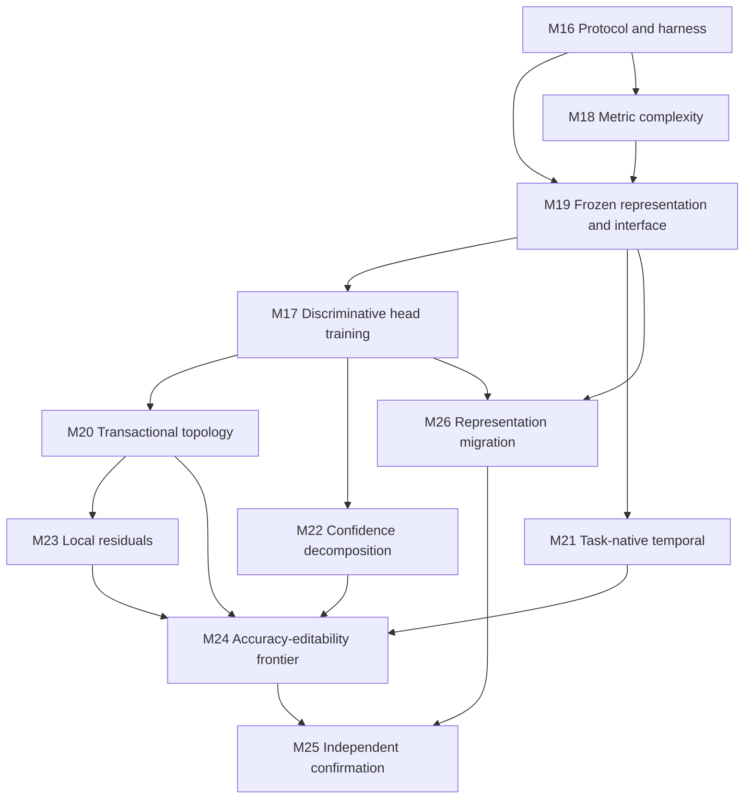

# GEODE Research Implementation Plan v5

**Date:** 26 July 2026

**Source:** `analysis/RESEARCH_REPORT_v5.md`, Sections 7-9

**Current state:** M0-M16 and M18 complete; E0-E6/E8-E11 complete; E7
local-small complete and physical multi-host qualification open

**Execution rule:** run synthetic and bounded studies before public-data
confirmation; do not weaken an existing frozen gate to advance a new method

---

## 1. Objective

This plan tests the report's central diagnosis:

> GEODE's present accuracy gap is caused by the interaction of representation,
> score semantics, primitive complexity, greedy structure selection, and
> objective mismatch rather than by explicit geometry in principle.

The implementation must answer seven questions separately:

1. Does a geometric head reach parity with black-box heads on the same strong,
   frozen commodity representation?
2. Does a one-time affine interface, trained before geometry and then frozen,
   make local quadratic structure more useful without weakening edit locality?
3. Do likelihood-aware scores, shared low-rank metrics, or discriminative head
   training close gaps that the current radial field and greedy constructor
   leave open?
4. Does GEODE retain value on task-native non-image representations?
5. Is GEODE's measurable editability and lifecycle safety sufficient to place
   it on a useful accuracy-editability Pareto frontier?
6. Can a change of frozen representation be migrated, reviewed, and rolled back
   with measurable component correspondence and edit survival?
7. Do conclusions survive the frozen linear, kNN, attentive-probe, transfer, and
   two-stage one-class protocols used by JEPA and adjacent self-supervised work?

The program does not assume that any answer is positive. A negative result that
isolates the responsible layer is a successful research outcome.

## 2. Claim and Safety Rules

1. Keep representation, head, readout, and lifecycle effects separately
   identifiable in every artifact.
2. Use frozen train/development/calibration/test indices across compared methods.
3. Select architecture, rank, topology, thresholds, and stopping rules without
   final-test access.
4. Match data, parameter count, optimizer steps, fit time, and hardware where
   the comparison claims budget parity; report both parameter-matched and
   compute-matched results when they differ.
5. Report raw field, calibrated posterior, support confidence, and review
   priority as different outputs.
6. Preserve current exact replay, calibration, graph validation, rollback, and
   fail-closed promotion contracts.
7. Keep exhaustive class-field evaluation authoritative. M12 routing remains
   shadow-only unless a later independent hardware study passes its existing
   quality and net-latency gates.
8. Keep CSG subtraction opt-in and evidence-triggered. Do not restore it as a
   default path.
9. Do not interpret conformal coverage as shift-robust unless the stated
   exchangeability assumptions hold.
10. Do not claim predictive superiority from non-inferiority, one seed, one
    representation, or exploratory model selection.
11. Do not enable autonomous class creation, semantic publication, or live
    mutation as part of this plan.
12. Preserve all negative artifacts and stopped branches in the milestone
    ledger.
13. Joint encoder-head gradient training is out of scope. Every encoder and
    affine interface must be frozen and hashed before geometry is fitted.
14. Treat representation replacement as a versioned migration event. Never
    reuse components, calibration objects, support profiles, or edit-locality
    claims across representation hashes without explicit migration evidence.
15. Distinguish analytic locality in the frozen representation from empirical
    locality on raw-input examples. A frozen nonlinear encoder does not make a
    component preimage simple, connected, recognizable, or semantic.
16. Use released foundation-model checkpoints only. Reproducing ImageNet-scale,
    LVD-142M, WM256, or internet-video pretraining is outside the evidence and
    compute boundary of this project.

## 3. Shared Experimental Contract

### 3.1 Data tiers

| Stage | Purpose                       | Data                                                     | Budget                               |
| ----- | ----------------------------- | -------------------------------------------------------- | ------------------------------------ |
| S0    | API and numerical correctness | synthetic Gaussian, manifold, and sequence fixtures      | seconds                              |
| S1    | discriminating smoke test     | bounded cached CIFAR-10 features and WikiText windows    | one seed, one fold                   |
| S2    | development study             | frozen CIFAR-10 development split                        | three seeds                          |
| S3    | primary image confirmation    | CIFAR-10 and CIFAR-100                                   | five independent seeds               |
| S4-I  | image-transfer confirmation   | Oxford Flowers-102                                       | three seeds for retained methods     |
| S4-T  | text-sequence confirmation    | locked WikiText-103 window protocol                      | only after the preceding gate passes |
| S4-V  | frozen-video evaluation       | HMDB-51 development; UCF-101 confirmation                | three seeds for retained methods     |
| S5    | support/OOD confirmation      | CIFAR-10 one-class; MVTec-AD image-level evaluation      | retained support methods only        |
| S6    | non-image breadth             | existing public ModelNet10 point-cloud task              | retained methods only                |

Use seed `11` for S1, seeds `11, 23, 37` for S2, and the existing E4 seed list
`11, 23, 37, 53, 71` for S3. M16 records these as protocol fields rather than
letting individual runners choose seeds. Expensive S4-S6 configs must declare
their seed list before training begins.

Because the S1/S2 seeds are subsets of the S3 confirmation list, every S1/S2
branch-kill or selection decision must use development metrics only. Any
hyperparameter or variant selection that requires a full training run uses the
separate seed-`42` pilot convention established by E4; seed `42` never appears
in a confirmatory seed list.

Final test labels remain sealed until a method and all hyperparameters pass the
preceding development gate. Existing cached feature artifacts may be reused only
when their fingerprints and split hashes match the manifest.

### 3.2 Required controls

Every applicable study includes:

- linear/logistic head;
- weighted kNN with frozen distance, normalization, and `k`;
- RBF head;
- prototype head;
- Gaussian discriminant or mixture-likelihood head;
- current frozen GEODE head;
- the proposed GEODE variant;
- attentive pooling probe for frozen video-token comparisons;
- an intrinsically interpretable prototype/tree control for editability studies
  when a compatible implementation and annotation regime exist;
- majority/frequency and task-native controls where relevant.

The same representation must feed every head in a head comparison. The same
head must consume every representation in a representation comparison.

### 3.3 Metrics

Primary predictive metrics:

- balanced accuracy and ordinary accuracy;
- multiclass NLL and Brier score;
- ECE with a frozen binning policy;
- paired per-example or per-seed confidence intervals.

Geometry and complexity metrics:

- primitive count and effective covariance rank;
- parameter bytes and serialized bundle bytes;
- fit and inference wall-clock time;
- component-assignment stability across seeds;
- analytic changed-region size in the frozen feature space;
- empirical changed-example fraction and unaffected-prediction preservation on
  the frozen input evaluation population;
- within-class scatter, between-class separation, intrinsic-dimension estimate,
  and kNN neighborhood purity for each representation;
- representation and interface hashes;
- component correspondence and accepted-edit survival across migrations.

Support and open-world metrics:

- AUROC, AUPR, and FPR95 for support detection;
- conformal marginal coverage and mean set size;
- flags per 1,000 observations and useful-review precision;
- disagreement and confidence calibration under declared shifts.

### 3.4 Common artifact schema

Each run writes a JSON record containing:

- milestone and experiment identifier;
- commit, configuration, environment, dataset, feature, and split hashes;
- method family, representation, head, readout, seed, and budget mode;
- checkpoint license/source, preprocessing, token pooling, probe architecture,
  and feature-cache hashes;
- selected hyperparameters and the development metric that selected them;
- raw per-split metrics, timing, memory, parameter counts, and warnings;
- advancement decision with every gate operand recorded explicitly;
- parent artifact identifiers for confirmation and replay.

New artifacts live under `logs/results/v5/`. A generated
`logs/results/v5/artifact_index.json` must enumerate every retained artifact and
its SHA-256 digest.

## 4. Dependency Order

M18 deliberately precedes the frozen-space comparison because covariance
complexity can be screened cheaply. M19 freezes the representation and optional
affine interface before M17 fits or differentiates any head. M17 consolidates
all differentiable score and component-parameter training inside that fixed
space; M20 is limited to discrete transactional topology proposals. M20-M23
advance only retained variants, and M26 evaluates representation replacement as
a migration rather than permitting encoder drift.

## 5. Milestone Map

| Milestone | Report recommendation                   | Report experiment    | Main question                                                                  |
| --------- | --------------------------------------- | -------------------- | ------------------------------------------------------------------------------ |
| M16       | evidence discipline and matched budgets | prerequisite         | **Complete:** deterministic protocol, matrix, lineage, statistics, and S0 gate |
| M17       | Priorities 2 and 4                       | B/C                  | Can discriminative head training close the gap in a fixed space?               |
| M18       | Priority 3                              | D                    | **Complete, negative:** adaptive policy failed both advancement gates           |
| M19       | Priority 1                              | A                    | Does geometry reach head parity under standard frozen probe protocols?         |
| M20       | Priority 2                              | C                    | Do transactional topology changes improve the trained fixed-space head?        |
| M21       | Priority 5                              | E                    | Does the head remain competitive on frozen text and video features?            |
| M22       | Priority 7                              | H/support study      | Can posterior, support, epistemic, conformal, and review outputs be separated? |
| M23       | Priority 6                              | local-boundary study | Do evidence-triggered local residuals help where global subtraction failed?    |
| M24       | Priority 8                              | F                    | What is the accuracy-editability Pareto frontier?                              |
| M25       | confirmation and claim control          | all retained         | Which conclusions transfer across datasets and seeds?                          |
| M26       | Priority 9                              | G                    | Can representation change be migrated and rolled back auditably?               |

## 6. M16: Protocol and Factorial Harness

**Status: complete (26 July 2026).**

### Deliverables

1. Add a declarative experiment schema under `experiments/configs/v5/`.
2. Add shared representation/head/readout interfaces without changing existing
   production bundle APIs.
3. Add parameter-count, fit-time, inference-time, memory, and artifact-hash
   instrumentation.
4. Add deterministic split and feature manifests for all S1-S5 datasets.
5. Add paired-comparison utilities that operate on saved predictions rather
   than rounded summary metrics.
6. Add a dry-run matrix enumerator that fails on missing controls or unequal
   split hashes.
7. Add representation-lineage and cache-compatibility guards that reject a
   component, calibration object, or support profile whose representation hash
   differs from the active bundle.
8. Add migration-report schema fields for source/target representation hashes,
   component correspondence, edit survival, invalidated artifacts, and rollback.

Suggested ownership:

- `experiments/common/v5_protocol.py`
- `experiments/common/v5_registry.py`
- `experiments/common/v5_artifacts.py`
- `experiments/common/v5_statistics.py`
- `experiments/common/test_v5_protocol.py`
- `experiments/configs/v5/`

These are new M16 deliverables, not assumed prerequisites. M16 must define the
data-stage enum, seed binding, paired-interval method, gate operand schema, and
formal Pareto-dominance function before a later runner can register itself.

### Tests

- schema rejection for missing provenance or gate operands;
- deterministic matrix expansion and artifact naming;
- parameter and byte counts on toy heads;
- split leakage and final-label access guards;
- paired-statistic checks against hand-computed fixtures;
- byte-identical rerun of one S0 matrix.

### Exit gate

One command must enumerate and run an S0 representation-by-head matrix twice,
produce byte-identical metric payloads, reject a deliberately mismatched split,
and regenerate its artifact index without training-data access.

### Completion evidence and observations

`python -m experiments.tier1.eval_v5_protocol_s0` enumerated ten cells crossing
two fixed representations with the five required heads. Two independent runs
were byte-identical, the deliberate split mismatch was rejected, and the final
index covered 14 artifacts under `logs/results/v5/m16_s0/`. The canonical
metrics payload hash is
`44a4a1d29d6ee3d5878cb8590969a3100ba9aaa0e529144530d0bc91c52e5460`.

M16 added 15 focused tests for schema rejection, seed binding, label-use guards,
lineage hashing, explicit gate operands, deterministic matrix expansion,
required controls, split matching, parameter/byte accounting, artifact indexing,
migration schema validation, paired statistics, Pareto dominance, and S0 replay.
The full repository gate increased from 213 to 228 tests.

The S1-S5 entries in `experiments/configs/v5/protocol.json` freeze protocol
identifiers and seed policies, but their concrete split and feature hashes remain
intentionally null until the corresponding datasets and frozen representations
are materialized. Every runner must supply those hashes before writing a run
record. M16 provides compatibility guards; production bundle APIs are unchanged.

## 7. M17: Discriminative Head Training in Frozen Space

This milestone merges the differentiable parts of the former score-semantics
and alternating-learning milestones. It implements Priorities 2 and 4 and the
differentiable portions of Experiments B/C, but it cannot begin until M19 has
frozen a representation and optional affine interface.

M17 never updates the encoder or interface. It starts from deterministic greedy
components fitted under one recorded representation hash and optimizes only
explicit head objects: centers, metric parameters, component temperatures, and
the retained score/readout parameters. Component count and topology remain
fixed here; split, merge, birth, and death belong exclusively to M20.

### Variants

Using one frozen space and identical constructor initialization, compare:

1. current normalized radial field with no supervised refinement;
2. Gaussian log likelihood with log determinant and class prior;
3. normalized per-class mixture likelihood;
4. globally temperature-scaled covariance likelihood retained by M15;
5. parameter-only discriminative training of centers and metrics with
   cross-entropy;
6. parameter-only training plus component temperatures and soft
   sample-to-component responsibilities;
7. linear, RBF, prototype, Gaussian-mixture, and compact-MLP heads on the same
   frozen features.

Do not reopen per-class covariance temperature or free mixture weights unless a
development result first beats the retained M15 global-temperature control.
Train only on the training split, select with development data, and reserve the
calibration split for post-training calibration.

Suggested ownership:

- extend `src/probabilistic_engine.py` only for reusable score semantics;
- consolidate differentiable head code in
  `experiments/common/v5_discriminative_head.py`;
- add `experiments/tier4/eval_v5_discriminative_head.py`;
- retain exact checkpoint/restart coverage through `src/sdf_optimizer.py`.

### Tests and measurements

- encoder and interface hashes are identical before and after every fit;
- finite analytic/autodiff gradients for every retained metric family;
- deterministic optimization from identical initialization;
- exact checkpoint/restart and rollback of head parameters;
- unchanged component identity and count throughout M17;
- balanced accuracy, NLL, Brier score, ECE, calibration convergence, component
  drift, and changed-region effects of parameter refinement;
- raw and calibrated results reported separately.

### Advancement gate

Retain a discriminatively trained head only if, over five confirmatory seeds, it
either:

- improves mean balanced accuracy by at least 0.5 percentage points over the
  strongest non-topology GEODE control with the paired 95% interval excluding
  zero; or
- reduces NLL by at least 2% with no balanced-accuracy loss greater than 0.25
  percentage points and no calibration-convergence failure.

It must also preserve at least 99.9% of predictions outside the measured region
affected by component-parameter movement and pass exact replay and rollback. If
likelihood wins while placement is fixed, treat score semantics as causal
evidence. If no differentiable variant passes, retain the existing fixed head
and do not open M20 merely to rescue a failed optimizer.

## 8. M18: Low-Rank, Shared Metrics, and Support Policy

**Status: complete with no advancement (26 July 2026).**

This milestone implements Priority 3 and Experiment D.

### Parameterizations

Add positive-definite metric parameterizations for:

- spherical precision;
- diagonal precision;
- full precision;
- diagonal plus low rank, $P_k=D_k+U_kU_k^\top$;
- global shared metric plus diagonal class correction;
- global low-rank subspace plus class-local diagonal metric.

Use stable factorizations and explicit eigenvalue floors. Avoid constructing a
dense inverse during inference when Woodbury-style solves are available.

Suggested ownership:

- `src/metric_parameterization.py`
- focused integration in `src/sdf_engine.py` and `src/greedy_constructor.py`;
- `experiments/tier1/eval_v5_metric_support_sweep.py`;
- `experiments/tier4/eval_v5_metric_policy.py`.

### Support sweep

Vary ambient dimension, known intrinsic rank, observations per component,
condition number, contamination, and class overlap. Freeze candidate ranks and
complexity penalties on synthetic development cells, then test unseen cells.

### Tests

- positive-definiteness and finite gradients;
- dense-versus-factorized score parity;
- serialization and exact replay for every metric family;
- deterministic rank selection;
- stable behavior at rank zero and at the full-rank boundary;
- no silent fallback without an artifact warning.

### Advancement gate

Advance a support-dependent policy only if it selects without final labels and
beats the best frozen single-family policy on the preregistered aggregate loss,
while reducing median parameter bytes or deterministic fit-work by at least 20%. Otherwise,
retain the existing primitive-family selection and publish the crossover map as
a negative or descriptive result.

### Completion evidence and observations

M18 implemented six opt-in positive-definite precision families: spherical,
diagonal, full, diagonal plus low rank, shared full plus class-diagonal
correction, and shared low rank plus class-local diagonal. The factorized
contract provides explicit eigenvalue floors, dense/factorized score parity,
analytic point gradients, deterministic serialization, parameter/byte
accounting, and conversion to existing ellipsoid semantics. The greedy
constructor accepts local metric fitting only through new opt-in arguments; its
default behavior is unchanged.

The preregistered sweep evaluated 1,920 development and 1,920 unseen test
records over three seeds while varying dimension, intrinsic rank, class support,
condition number, contamination, and separation. Development selected
`shared_full_diagonal` as the best frozen single candidate and in four of five
support bins; `diagonal_low_rank:rank=0` was selected only for
`medium:high_rank`.

On unseen cells, the support policy had aggregate loss 0.34797 versus 0.34244
for the frozen `shared_full_diagonal` control, balanced accuracy 86.859% versus
87.183% (-0.323 percentage points), and NLL 0.31512 versus 0.31040. Median
parameter bytes were identical at 540, and deterministic median fit-work was
identical at 9,996 units. Predictive and resource gates therefore both failed. The policy does not
advance to M19/M17. The complete crossover evidence is under
`logs/results/v5/m18_metric_support/`.

## 9. M19: Frozen Commodity Representation and Interface

This milestone implements Priority 1 and Experiment A. Its deliverable is a
frozen, hash-addressed feature space, not a jointly training pipeline.

### Representation arms

1. current frozen MobileNetV2 features;
2. frozen DINOv2 features;
3. frozen I-JEPA features from a released checkpoint;
4. frozen SigLIP features, with CLIP permitted only as a preregistered fallback
   if the SigLIP artifact cannot be acquired under the environment constraints;
5. each retained backbone optionally followed by one small affine interface:
   either a linear projection or a preregistered low-rank affine map;
6. a separately trained and frozen task-native encoder where the dataset
   requires one.

If an I-JEPA checkpoint cannot be acquired with a compatible license,
preprocessing specification, and deterministic loader, record that arm as
blocked rather than substituting an unregistered implementation. Do not train
I-JEPA, DINOv2, or SigLIP from scratch.

Nonlinear or residual adapters are out of scope because they weaken geometric
semantics and make changed-region volume harder to interpret. The backbone never
receives gradients. Train the affine interface once under the pre-test
development protocol before fitting any component, then freeze it forever for
that representation version.

The interface objective is:

$$
L=L_{\mathrm{CE}}
+\lambda_{\mathrm{compact}}L_{\mathrm{within}}
+\lambda_{\mathrm{margin}}L_{\mathrm{between}}
+\lambda_{\mathrm{complexity}}\Omega.
$$

Implement each term independently and include identity/no-interface, CE-only,
metric-only, and full-objective ablations. M16 must freeze a finite list of at
most 16 `(lambda_compact, lambda_margin, lambda_complexity)` tuples. Select one
tuple per interface family on S2 development loss using seed `11`, then freeze
it for all other S2 seeds and S3 confirmation. Do not tune per seed or with
geometry already fitted. Fit interface weights on the training partition; use
development data only for tuple selection and stopping. Any temporary linear
classifier used by the CE term is discarded before the interface is hashed.

### Frozen-space head probe

After each representation/interface artifact is frozen, fit from scratch:

- weighted kNN with preregistered normalization, distance, and `k`;
- linear/logistic;
- RBF;
- prototype;
- Gaussian mixture;
- current GEODE.

M19 uses the current non-discriminative GEODE head so representation quality is
not confounded with M17 optimization. M17 then trains all retained heads inside
the selected fixed spaces.

Run CIFAR-10/100 for continuity with existing evidence. Run Oxford Flowers-102
as the preselected transfer check for retained representations because its
higher-resolution inputs and 102 relatively low-support classes test whether a
strong pretrained space reduces GEODE component complexity outside the CIFAR
domain. Cache one feature tensor per representation, preprocessing policy, and
split; every head consumes that exact cache.

ImageNet-1K frozen linear and kNN probing is the external reference protocol, not
a core gate. Any later ImageNet run must be separately budgeted and must not be
used to retune a method selected on S2/S3.

Suggested ownership:

- `src/representation_adapter.py` for affine maps and serialization only;
- `experiments/common/v5_frozen_representations.py`;
- `experiments/tier4/eval_v5_frozen_space_heads.py`;
- `experiments/tier5/eval_v5_frozen_space_confirmation.py`.

### Artifact and budget contract

Every representation artifact records the backbone identifier, upstream weights
digest, preprocessing digest, interface architecture and weights digest,
training split and objective hashes, output dimension, token-pooling policy,
checkpoint source and license, and parent artifact.
Feature caches key on the complete representation hash. Components, calibration
objects, and support profiles must record that same hash and fail closed on a
mismatch.

Run parameter-matched and wall-clock-matched head budgets. Interface training
cost is reported separately as one-time preparation cost; it is not hidden in a
head budget. Wall-clock comparison must use one recorded environment or be
marked blocked.

### Advancement gate

Retain a representation/interface artifact only if it is byte-replayable,
passes the hash-mismatch guards, and improves either the strongest same-head
development result or geometric compactness without more than a 0.25 percentage
point accuracy loss. The geometry hypothesis advances to M17 if GEODE is within
0.5 percentage points of the strongest black-box head on at least one strong
frozen space. A GEODE win requires the paired 95% interval over the strongest
same-space control to exclude zero; parity or non-inferiority must not be
described as superiority.

Geometric compactness is not inferred from linear-probe accuracy. It must improve
at least one preregistered measure—within-class scatter, neighborhood purity, or
components required at fixed coverage—without materially worsening the other
two. Report representation effects separately from head effects.

Primitive-family comparisons must use family-correct fitting budgets. Spheres
use a direct spherical covariance fit with \(d+2\) seed points. They must neither
inherit the generic custom-fitter \(2d+1\) seed nor be fit as full ellipsoids and
projected afterward. The corrected five-seed CIFAR-10 rerun is complete:
spherical covariance wins all five selection seeds and averages 83.96% test
accuracy versus 81.03% for full covariance. The paired advantage is 2.94
percentage points with a 95% t-interval of [2.47, 3.40]. Spheres require more
primitives (139.8 versus 58.6) and more fit time (0.364 versus 0.241 seconds), so
the retained claim is accuracy superiority under the measured budget, not
parameter or runtime efficiency. The pre-correction artifact remains
superseded. Spheres are now the constructor and shared-helper default; full and
diagonal ellipsoids require explicit selection.

The corrected five-seed primitive-by-CSG rerun is also complete. Spherical A0
accuracy is 83.94%, versus 81.75% for full covariance and 83.50% for diagonal
covariance. Sphere minus full is +2.19 percentage points [0.93, 3.45], while
sphere minus diagonal is +0.44 points [-0.12, 0.99]. A1/A2 subtraction changes
mean accuracy by 0.00 points for every family. Spheres and diagonal ellipsoids
accept no carvings; full covariance accepts nine but has a 0.00 point mean
effect [-0.05, 0.05]. Keep subtraction opt-in.

The corrected downstream spherical reruns are frozen in separate `dplus2`
artifacts. The hybrid-field and global-temperature gates pass, but the
per-class-temperature gate fails. These results supersede the corresponding
old-seed spherical artifacts without changing the rule that later stages must
advance only through their preregistered gates.

### Current S1 execution evidence

The weighted-kNN, provenance, and I-JEPA increments have completed on a fresh
bounded S1 extraction. Representation manifests now use schema v2 and bind
checkpoint source, license, and token-pooling policy into the representation
hash while retaining strict loading of legacy schema-v1 artifacts. Extraction
verifies the configured model SHA-256 before inference. Pooling policies bind to
named ONNX outputs and fail closed on a missing tensor or wrong rank. The
evaluator resolves the exact cache declared by the extraction summary, verifies
its content hash, and refuses configuration/provenance mismatches.

Fresh schema-v2 extraction and evaluation produced:

- DINOv2-small identity features: weighted-kNN accuracy 93.00%, versus 95.00%
  for the strongest S1 head;
- SigLIP identity features: weighted-kNN accuracy 87.67%, versus 89.67% for the
  strongest S1 head;
- I-JEPA ViT-H/16 int8 identity features: weighted-kNN accuracy 80.33%, versus
  86.33% for the strongest S1 head;
- lower weighted-kNN accuracy after both tested affine interfaces for all three
  backbones.

Identity-space representation diagnostics on the frozen training split are:

| Backbone | 10-NN purity | Median local intrinsic dimension | Mean within-class radius | Minimum centroid separation | Radius/separation |
| --- | ---: | ---: | ---: | ---: | ---: |
| DINOv2-small | 0.8284 | 21.1387 | 39.2080 | 22.9831 | 1.7060 |
| SigLIP | 0.7512 | 19.4977 | 7.4139 | 4.2776 | 1.7332 |
| I-JEPA ViT-H/16 int8 | 0.6146 | 15.2193 | 10.5738 | 5.1952 | 2.0353 |

Both affine interfaces lower raw radius and estimated intrinsic dimension but
also lower neighborhood purity. Their radius/separation ratio generally
worsens; SigLIP's linear interface improves that ratio from 1.7332 to 1.6855
but lowers weighted-kNN accuracy from 87.67% to 81.33%, far outside the
0.25-percentage-point tolerance. No interface passes the retention rule.

Component efficiency uses the preregistered rule selected before measurement:
for each class, count primitives in deterministic GEODE constructor-prefix order
until 95% of that class's frozen training examples satisfy the declared
`capture_threshold`. Report the mean and maximum only if every class reaches the
target; otherwise report `target_unmet` and per-class achieved coverage. The
historical identity arms are blocked by the bounded S1 128-dimensional GEODE
limit and also lack the class support required by the current \(d+2\) spherical
contract. Every 64-dimensional affine arm has 50 examples per class for a
66-point sphere seed, accepts zero primitives, and reaches 0% coverage, so no
component-efficiency summary is imputed.

The corrected SigLIP result supersedes the prior 29.00% figure, which was
produced by selecting `last_hidden_state[:,0]` even though the representation
declared `pooler_output`. I-JEPA is pinned to ONNX revision
`59ebd911845f639c18e06b1239ac243a30a7d35f`, uses mean patch-token pooling, and
retains its CC BY-NC 4.0 restriction; it is admitted only for non-commercial
research evaluation.

The bounded Flowers-102 transfer evaluation is complete on deterministic
official-split subsets with 5/2/3 examples per class:

| Backbone | Weighted kNN | Linear | Prototype | 4-NN purity | Compactness ratio |
| --- | ---: | ---: | ---: | ---: | ---: |
| DINOv2-small | 99.02% | 99.35% | 99.02% | 0.9275 | 0.7740 |
| SigLIP | 94.77% | 97.39% | 97.39% | 0.7980 | 0.9625 |
| I-JEPA ViT-H/16 int8 | 43.14% | 63.73% | 52.29% | 0.2544 | 1.4188 |

Full-covariance GMM and native spherical GEODE are support-blocked rather than
forced through invalid fits. GEODE requires \(d+2\), or 386/770/1,282 points
per class for the three native spaces, versus five available here.

These are one-seed bounded feasibility observations, not confirmatory estimates.
They show that the frozen probe and provenance contracts execute end to end, and
that linear-probe quality or reduced within-class scatter cannot be assumed to
imply useful local geometry. Flowers preserves the DINOv2 > SigLIP > I-JEPA
ordering but does not pass the native GEODE support gate. S2/S3 independent
seeds remain open.

The native 384-dimensional DINOv2 spherical study is also complete at the exact
\(d+2=386\) training examples per class, with 100 development and 200 test
examples per class. GEODE fits one sphere per class and reaches 80.90% test
accuracy, versus 96.50% RBF, 96.15% linear, 95.95% weighted-kNN, and 94.70%
prototype. Per-class training coverage is 50.00% to 58.03%; every residual pool
then falls below 386, so no second sphere can fit and the 95% component target
is unmet. Treat \(d+2\) as a minimum fitting condition, not a recommended sample
size. A support-scaling follow-up must include a tier large enough for at least
two sphere seeds after first-stage capture.

The seed-11 support pilot is complete at 1,000 training examples per class.
With the one-candidate budget held fixed, GEODE fits 4--15 spheres per class
(70 total), reaches 86.25% test accuracy, and covers 61.50--80.60% of each
training class. This improves over the exact-\(d+2\) result by 5.35 percentage
points but still leaves every class below the 95% coverage target and trails
the matched 96.70% weighted-kNN and RBF controls. Multi-sphere growth is
therefore feasible and seeds `11, 23, 37` advance at the frozen 1,000-example
support level; no hyperparameter may be changed between those runs.

## 10. M20: Transactional Topology Search

This milestone implements only the discrete part of Priority 2 and Experiment C
using a retained M17 head in its frozen M19 space. It does not vary or update the
representation, interface, score semantics, or gradient optimizer again.

### Optimization cycle

1. initialize with the deterministic greedy constructor;
2. optimize head parameters with the frozen M17 procedure;
3. propose one held-out split, merge, birth, or death operation;
4. initialize parameters for only the affected components;
5. re-run the frozen M17 optimizer without changing its settings;
6. accept only under a complexity-penalized development objective;
7. snapshot before acceptance and run exact replay and rollback checks;
8. stop on a frozen patience and operation budget.

Use at most 25 alternating rounds. Stop after five consecutive rounds without
at least `1e-4` improvement in the normalized development objective. Permit at
most ten accepted topology operations per class, of which no more than two may
be births and two deaths. M16 stores these values in the registered M20 gate so
the runner cannot override them.

Suggested ownership:

- `src/alternating_constructor.py`
- reusable transaction hooks in `src/model_editor.py`;
- `experiments/tier1/eval_v5_topology_recovery.py`;
- `experiments/tier4/eval_v5_alternating_topology.py`.

### Controls

- greedy construction only;
- retained M17 parameter-only refinement;
- split/merge only;
- complete transactional topology cycle;
- Gaussian-mixture EM as prior-art control.

### Tests

- monotone accepted development objective;
- deterministic proposal ordering;
- exact rollback after each proposal type;
- no orphaned component or invalid graph after birth/death;
- bounded component count and operation count;
- recovery of known synthetic topology without using test labels.

Implement these checks in `experiments/tier1/test_v5_alternating_topology.py`.

### Advancement gate

Advance only if the complete cycle improves mean balanced accuracy by at least
0.5 percentage points over retained M17, does not increase median
component count by more than the preregistered budget, and preserves at least
99.9% of predictions outside the measured changed region after a local edit.

## 11. M21: Task-Native Text and Video Representations

This milestone implements Priority 5 and Experiment E as two independent tracks.
The existing locked WikiText-103 protocol tests text sequences. A new frozen-video
track imports the V-JEPA attentive-probe evaluation pattern without reproducing
video foundation-model pretraining.

### M21-T: text encoders

- exact window and deterministic reservoir controls;
- causal temporal convolution;
- GRU and LSTM;
- small causal Transformer;
- selective state-space encoder in an isolated compatible environment, if its
  reference implementation passes the same reproducibility contract.

Use PyTorch modules for TCN, recurrent, and Transformer controls. Do not make an
optional selective-SSM dependency a blocker for the core experiment.

If no compatible selective-SSM reference environment is available, complete the
core M21 matrix and record the selective-SSM arm as blocked. Do not add that arm
retroactively to a locked confirmation matrix or make claims comparing GEODE to
selective SSMs.

Cross each frozen encoder output with linear and GEODE heads. Keep matched-data
5-gram and frequency controls. The primary comparison is the head effect within
one encoder, not GEODE versus an end-to-end language model of a different scale.
Every encoder is trained separately, frozen, and hashed before either head is
fitted; no head gradient may cross the encoder boundary.

### M21-V: frozen video encoders and probes

Use HMDB-51 for development and UCF-101 for confirmation. Preserve each
dataset's official split definition and preregister clip sampling, frame rate,
resize/crop, temporal stride, and token-pooling policy. Extract features once
from:

- a released frozen V-JEPA checkpoint when its loader, license, and preprocessing
  contract are available; and
- one preregistered public video baseline checkpoint, such as VideoMAE, so the
  track does not depend on one artifact provider.

Do not train either video encoder. Do not use Something-Something v2,
Kinetics-400, Epic-Kitchens, or V-JEPA 2 language-model alignment as core gates.
Those protocols are external references whose data, I/O, or model scale exceed
this plan.

On identical cached clip tokens or pooled features, compare:

- weighted kNN;
- linear probe;
- a two-layer attentive pooling probe with preregistered capacity;
- prototype head;
- GEODE.

The attentive probe is a head control, not part of the representation. Its
parameter count, fit time, and pooling inputs must be reported separately.
Published V-JEPA results are comparable only when checkpoint, preprocessing,
split, and probe capacity match; otherwise they are contextual references.

Suggested ownership:

- `src/temporal_encoders.py`
- `experiments/tier6/eval_v5_temporal_factorial.py`
- `experiments/tier6/eval_v5_frozen_video_heads.py`
- `experiments/configs/v5/temporal_factorial.json`.

### Advancement gate

Advance text and video claims separately. A GEODE claim advances only if it is
non-inferior within 0.25 percentage points to the strongest same-encoder head and
contributes a separately measured editability, support, or calibration benefit.
A task-native encoder gain shared by all heads is representation evidence, not
geometric-head evidence. Failure or blockage of M21-V must not alter conclusions
from M21-T.

## 12. M22: Confidence Decomposition

This milestone implements Priority 7 without changing the classifier.

### Outputs

Expose a typed result containing:

- calibrated relative class posterior;
- in-support score and support-profile version;
- ensemble or bootstrap disagreement;
- conformal prediction set and calibration-split identifier;
- review-priority score;
- assumptions and validity warnings.

Suggested ownership:

- `src/confidence_decomposition.py`
- opt-in integration in `src/inference_engine.py`;
- `experiments/tier4/eval_v5_confidence_decomposition.py`.

Keep existing `predict` behavior and return types unchanged. Add an explicit
opt-in `predict_with_confidence` path whose typed result carries the decomposed
outputs and provenance.

### Controls and tests

- maximum softmax probability, energy, Mahalanobis, and k-NN support controls;
- CIFAR-10 one-class protocol: train on one class at a time and test against all
  remaining classes, yielding ten frozen binary support tasks;
- image-level MVTec-AD confirmation for support methods retained on CIFAR-10;
- split-conformal coverage on exchangeable in-distribution data;
- explicit coverage degradation under controlled shift;
- serialization and replay of every calibration object;
- no API path that silently aliases support confidence to class posterior;
- bounded review-budget evaluation using the existing review lifecycle.

For each one-class task report AUROC, AUPR, and FPR95 per class and macro
averages. Use the same frozen representation cache for kNN, Mahalanobis, Gaussian
likelihood, raw GEODE field, and calibrated GEODE support scores. MVTec-AD pixel
localization is out of scope because the current head emits image-level support;
do not report localization metrics from a global embedding.

### Advancement gate

The API advances if posterior calibration does not regress, support detection
beats raw SDF on the frozen OOD suite, improves macro FPR95 or AUROC over the
strongest same-representation distance control with a paired interval excluding
zero, and conformal coverage meets its declared target on exchangeable
confirmation data. Shift failures must remain visible and block any autonomous
interpretation.

## 13. M23: Evidence-Triggered Local Residuals

This milestone implements Priority 6 only after M20 identifies stable residual
boundary errors.

Open M23 only if the frozen M20 development artifacts contain at least three
classes with at least 50 recurring boundary errors each, observed in all three
S2 seeds and not removed by parameter-only refinement. Otherwise mark M23
skipped for insufficient stable residual evidence.

### Candidate corrections

- explicit negative primitive;
- localized additive primitive assigned to the competing class;
- bounded smooth neural residual with compact spatial gating;
- no correction.

A candidate may be proposed only from an independently verified exclusion
region. Selection uses development boundary loss, not training capture.

Suggested ownership:

- `src/local_residual.py`
- transaction integration through `src/model_editor.py`;
- `experiments/tier4/eval_v5_local_residuals.py`.

### Advancement gate

Accept a correction only if it improves held-out boundary loss and target-class
accuracy, preserves global balanced accuracy within 0.25 percentage points,
keeps calibration within tolerance, and passes exact rollback. The study must
report residual bytes, changed-region size, and collateral prediction changes.
If no correction passes, retain additive geometry without subtraction.

## 14. M24: Accuracy-Editability Frontier

This milestone implements Priority 8 and Experiment F.

### Compared model families

- retained GEODE variants;
- prototype classifier;
- boosted tree for applicable tabular representations;
- compact MLP trained only as a head on the same frozen features;
- Gaussian mixture or RBF control;
- ProtoPNet or ProtoTree on a compatible image task when a frozen-backbone
  configuration can be matched;
- concept bottleneck model only on a separately declared dataset with genuine
  concept annotations.

Do not label feature-space components as concepts merely to make the
concept-bottleneck comparison available. If no fair concept-supervised dataset
is in scope, record that control as not applicable.

### Matched edit tasks

Build a frozen edit suite covering:

- correct one local false-positive region;
- add one confirmed known-class mode;
- suppress one corrupted cluster;
- recalibrate after a bounded shift;
- roll back every edit.

Each model receives the same edit evidence and wall-clock budget. Model-specific
editing methods are allowed but must be declared before final evaluation.

### Metrics

- target correction rate;
- exact preservation of unaffected predictions;
- analytic changed-region volume in the frozen representation;
- empirical changed-example fraction on the fixed input evaluation set;
- edit and rollback latency;
- examples and labels consumed per accepted edit;
- calibration drift;
- audit artifact bytes and human review burden;
- post-edit accuracy, NLL, model bytes, and inference latency.

### Advancement gate

Construct a Pareto frontier rather than one weighted score. Use six axes:
balanced accuracy, unaffected-prediction preservation, rollback success,
accepted-edit evidence count, edit latency, and inference latency. Higher is
better for the first three and lower is better for the final three. Method A
dominates B only when A is no worse on every axis and strictly better on at least
one axis under the frozen point-estimate convention.

GEODE's editability claim advances only if at least one retained variant is
non-dominated in the pooled analysis and in at least three of five S3 seeds, is
accuracy-non-inferior within 0.25 percentage points to at least one non-GEODE
control, and has a paired confidence interval showing improvement on either
unaffected-prediction preservation or evidence count. Add deterministic
dominance and seed-stability tests under
`experiments/common/test_v5_protocol.py`. If GEODE is dominated, narrow the
project claim to audited lifecycle integration and preserve the negative result.

Any statement about semantic edit locality additionally requires component
retrieval panels and blinded human review showing that the edited component has a
coherent, reproducible intent. Otherwise restrict the claim to feature-space and
empirical prediction locality.

## 15. M25: Independent Confirmation and Claim Update

### Confirmation matrix

Confirm only variants retained by M17-M24 and the M26 migration protocol on:

- CIFAR-10;
- CIFAR-100;
- Oxford Flowers-102 for image-transfer claims;
- locked WikiText-103 for text-sequence claims;
- UCF-101 for video claims retained on HMDB-51;
- CIFAR-10 one-class and MVTec-AD for support claims;
- the existing public ModelNet10 point-cloud task as the preselected additional
  non-image breadth check.

Use five seeds for primary image claims and at least three independent seeds for
expensive non-image claims. Run confirmation from frozen artifacts and configs in
a clean environment.

### Required outputs

1. one immutable artifact index with hashes;
2. one principal-results table generated only from artifacts;
3. one negative-results table including every stopped branch;
4. representation-by-head interaction estimates;
5. accuracy-editability Pareto plots;
6. a claim ledger labeling each statement exploratory, non-inferior,
   confirmatory, negative, or blocked;
7. representation-migration correspondence and edit-survival reports;
8. feature-space and empirical input-set locality reported as separate columns;
9. a reproduction command that does not load training data.

### Final gate

No method becomes the GEODE default unless it passes its own milestone gate and
independent confirmation while preserving the existing E9-E11 lifecycle
contracts. Update the README and research report only to the strongest claim
supported by the locked artifacts.

## 16. M26: Representation Migration Study

This milestone implements Priority 9 and Experiment G. It treats representation
replacement as a versioned lifecycle event, never as continued training of an
existing model.

### Migration pairs

Use at least two preregistered pairs drawn from retained M19 artifacts:

- current MobileNetV2 space to the strongest retained DINOv2 or SigLIP space;
- current MobileNetV2 space to a retained I-JEPA space;
- one retained backbone without an affine interface to the same backbone with
  its frozen interface;
- optionally, DINOv2 to I-JEPA or SigLIP if both endpoints pass M19.

For each pair, take a complete v1 bundle containing geometry, calibration,
support profiles, and a frozen suite of accepted edits. Create a v2 bundle by
embedding the same fitting data with the new frozen artifact and refitting
geometry under the retained M17/M20 procedure. Never transform or silently reuse
v1 components, calibration objects, or support profiles as if they belonged to
v2.

### Correspondence and migration report

Produce a deterministic bipartite component-correspondence report using frozen
development examples as anchors. The report must include:

- one-to-one matches, splits, merges, births, deaths, and unmatched mass;
- overlap and label-consistency scores for every proposed correspondence;
- whether each accepted v1 edit survives unchanged, maps to one or more v2
  components, or requires review;
- calibration and support-profile invalidation and rebuild evidence;
- predictive and calibration deltas between v1 and v2;
- analytic feature-space changed-region summaries and empirical changed-example
  sets kept separate;
- exact rollback evidence restoring the complete v1 bundle.

Include a compact MLP head on each frozen space as a control. Report that
control's predictive change and retraining cost, and explicitly mark component
correspondence, edit survival, and exact structural rollback as unavailable
rather than assigning it success-shaped defaults.

Suggested ownership:

- `src/representation_migration.py`;
- migration transactions through `src/model_editor.py` and the existing bundle
  registry;
- `experiments/tier4/eval_v5_representation_migration.py`;
- `experiments/tier1/test_v5_representation_migration.py`.

### Tests

- fail closed when any source or target representation hash is missing;
- deterministic correspondence under input-order permutations;
- explicit split, merge, birth, death, and unmatched synthetic fixtures;
- no reuse of stale calibration or support artifacts;
- byte-exact rollback to the complete v1 bundle;
- migration report reproduction without training-data access.

### Advancement gate

The audited-migration claim advances only if every tested migration produces a
complete correspondence report, invalidates and rebuilds all derived artifacts,
and rolls back byte-exactly. At least 90% of anchor mass must be accounted for
by correspondences, and at least 90% of accepted edits must either survive or be
flagged for review with no silent semantic change. These thresholds establish
operational coverage, not semantic identity. If the gate fails, representation
replacement remains a full retrain with no edit-survival claim.

## 17. Parallel Operational Track: Physical E7

Physical multi-host E7 remains mandatory for a distributed qualification claim,
but it is independent of the learning milestones above. Run it when at least
three physical hosts are available, using the existing frozen E7 protocol.

Do not:

- count logical containers as physical-host qualification;
- redesign the learner during the E7 qualification run;
- block S0-S3 learning research while infrastructure is unavailable; or
- describe local-small recovery as full distributed qualification.

## 18. Stop Conditions

Stop a branch when any of the following occurs:

- its cheap discriminating gate fails;
- final labels influenced selection;
- the comparison cannot be made representation- or budget-matched;
- exact replay or rollback regresses;
- an encoder or interface changes after component fitting begins;
- a migration reuses a stale component, calibration object, or support profile;
- calibration does not converge under the frozen optimizer budget;
- complexity grows outside the declared bound;
- a result depends on one seed or one untracked environment;
- a simpler retained control dominates it on all declared endpoints.

Stopped branches remain documented; they are not silently retuned into passing.

## 19. Initial Execution Sequence

1. **Complete:** implement M16 schemas, manifests, matrix enumeration, and S0
   replay.
2. **Complete, no advancement:** run M18 synthetic support sweeps; do not adopt
   the learned metric policy after both policy gates failed.
3. **Next:** acquire, license-check, fingerprint, and cache the frozen DINOv2,
   I-JEPA, and SigLIP/CLIP arms for M19.
4. Run bounded M19 interface training, freeze and hash each retained interface,
   then execute weighted-kNN, linear, prototype, mixture, and GEODE probes on
   the identical feature caches.
5. Run M17 discriminative head training only inside retained M19 spaces.
6. Run M20 and the M21-T text track after M17 freezes the retained image head;
   run M21-V from frozen video artifacts independently.
7. Implement M22 and its CIFAR-10 one-class protocol against the unchanged
   retained classifier, then confirm retained support methods on MVTec-AD.
8. Run M23 only if a stable local residual cohort exists.
9. Freeze the edit suite, then run M24.
10. Run M26 migration pairs using the frozen edit suite and retained bundles.
11. Lock retained methods and execute M25 confirmation.

The immediate next milestone is M19. M18 added reusable opt-in metric
parameterizations but did not change the production default because its adaptive
policy failed both frozen gates. The JEPA-informed additions change the
representation and evaluation matrix, not the frozen-trunk safety boundary.
