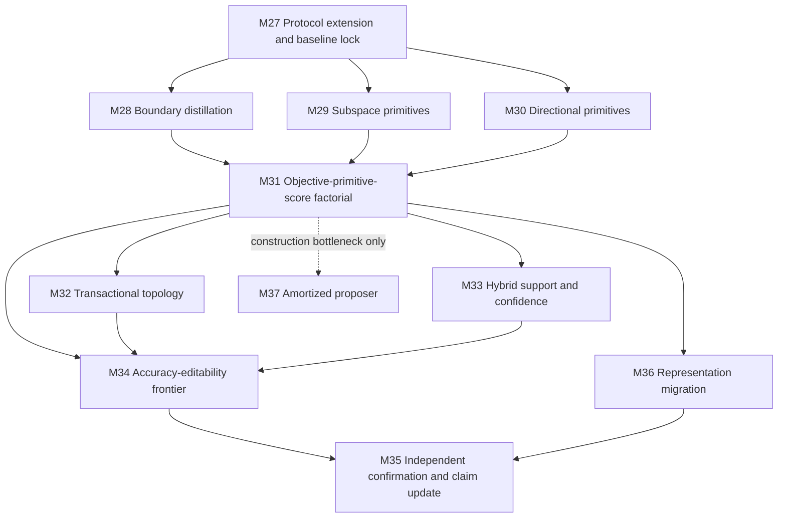

# GEODE Research Implementation Plan v6

**Date:** 26 July 2026

**Source:** `analysis/RESEARCH_ANALYSIS_SDF_COMPETITIVENESS.md`

**Supersedes:** the execution order of open work in
`analysis/RESEARCH_IMPLEMENTATION_PLAN_v5.md`. Completed v5 evidence, frozen
gates, artifacts, and negative results remain authoritative.

**Current state:** M0-M16, M18, and M27 are complete. M19 bounded
representation studies are complete enough to identify the primary bottlenecks.
The next work is M28 boundary distillation, not additional representation or
affine-interface search.

---

## 1. Program Objective

The program will test whether an explicit geometric head can:

1. reach within **1.0 percentage point** of the strongest same-representation
   black-box head on independently confirmed image tasks;
2. preserve exact replay, rollback, provenance, and fail-closed promotion;
3. remain non-dominated on a frozen accuracy-editability-lifecycle frontier.

The target is **same-space head competitiveness**, not end-to-end state of the
art. Encoders remain released, frozen, and hash-addressed. A positive result is
statistical parity with the best head in that frozen space plus a lifecycle
advantage. A clean negative result is also in scope.

The plan tests the following priority ordering:

1. **objective:** place capacity near class boundaries rather than maximizing
   class-conditional coverage;
2. **sample complexity:** replace ambient-dimension seed requirements with
   intrinsic-rank requirements;
3. **ambient metric:** use directional geometry for normalized foundation-model
   embeddings;
4. **score semantics:** make cross-class scores comparable with proper
   likelihood or teacher-margin semantics;
5. **topology and construction speed:** optimize only after the preceding
   representation of the problem is shown to work.

## 2. Frozen Evidence and Baselines

The following results are inputs to this plan and must not be retuned away:

| Evidence                  | Frozen observation                             | Planning consequence                                     |
| ------------------------- | ---------------------------------------------- | -------------------------------------------------------- |
| HOG-era CIFAR-10          | spherical GEODE 83.96%; controls about 84%     | explicit geometry is viable in weak spaces               |
| CIFAR-100 superclass      | GEODE trails RBF by 2.87 pp                    | calibration alone is insufficient                        |
| DINOv2, 386/class         | GEODE 80.90%; RBF 96.50%                       | ambient support minimum produces one-sphere starvation   |
| DINOv2, 1,000/class pilot | GEODE 86.25%; kNN/RBF 96.70%                   | more spheres help but do not repair the objective        |
| Flowers-102, 5/class      | GEODE support-blocked; linear 99.35%           | the `d+2` contract excludes the key few-shot regime      |
| M18                       | adaptive metric policy failed both gates       | reuse parameterizations, not the failed selection policy |
| M19 interfaces            | all tested affine interfaces reduce kNN purity | stop affine-interface search                             |
| M14                       | calibration improves without accuracy movement | score calibration is not boundary learning               |
| M12                       | certified routing is exact but not faster      | exhaustive evaluation remains authoritative              |
| CSG reruns                | subtraction is null                            | keep subtraction opt-in and out of the main path         |

The primary development space is the frozen native 384-dimensional DINOv2
cache. Identity/no-interface is the only active interface. RBF and weighted kNN
are the principal predictive controls. Existing spherical GEODE is the
geometric baseline.

## 3. Scope and Non-Goals

### In scope

- RBF or compact-MLP teacher distillation into explicit geometric artifacts;
- margin-weighted and loss-reduction-based component placement;
- local rank-\(r\) subspace primitives with isotropic residuals;
- cosine-native spherical-cap primitives;
- Gaussian/mixture log-likelihood scores with class priors and log determinants;
- transactional topology changes after a fixed-topology head passes;
- hybrid geometric-likelihood and cached-feature kNN support scoring;
- matched editability, rollback, audit, and migration evaluation.

### Out of scope

- encoder fine-tuning or joint encoder-head gradients;
- more affine-interface families;
- restoring per-class temperature scaling;
- restoring adaptive metric policy as a default;
- default CSG subtraction;
- autonomous class creation or live model mutation;
- topology search used to rescue a failed objective or primitive family;
- raw end-to-end state-of-the-art accuracy claims;
- new text claims until the image-head hypothesis passes;
- amortized construction unless retained geometry is accurate but construction is
  demonstrably the remaining bottleneck.

## 4. Claim, Safety, and Selection Rules

1. M16 remains the protocol authority. Extend its schema; do not bypass it.
2. Keep train, development, calibration, and final-test indices frozen.
3. Use development labels only for construction, optimization, and selection.
4. Use seed `42` for disposable pilot selection; never include it in
   confirmation.
5. Use seed `11` for S1, `11, 23, 37` for S2, and `11, 23, 37, 53, 71` for
   S3.
6. Hash the encoder, preprocessing, feature cache, teacher, primitive family,
   score semantics, constructor, and optimization configuration.
7. Treat the teacher as training supervision, not as part of inference. A
   promoted bundle must contain only explicit geometric head objects and their
   calibration/support artifacts.
8. Keep exhaustive class-field evaluation authoritative.
9. Preserve component identity, exact replay, rollback, graph validation, and
   fail-closed representation compatibility.
10. Report raw scores, calibrated posterior, support confidence, and review
    priority separately.
11. Report teacher agreement and ground-truth performance separately. Agreement
    is not accuracy.
12. Match parameter or compute budgets when claiming parity. Report both when
    conclusions differ.
13. Preserve every stopped branch and gate operand in the artifact ledger.
14. Do not change a gate after observing its final-test result.
15. Do not describe one-seed feasibility, non-inferiority, or parity as
    superiority.

## 5. Shared Experimental Contract

### 5.1 Data stages

| Stage | Purpose                                 | Data                                        | Seeds                  |
| ----- | --------------------------------------- | ------------------------------------------- | ---------------------- |
| S0    | API, gradients, geometry, serialization | synthetic blobs, manifolds, spherical caps  | deterministic fixtures |
| S1    | cheap falsification                     | bounded frozen DINOv2 CIFAR-10 cache        | 11                     |
| S2    | development and retention               | frozen DINOv2 CIFAR-10 development protocol | 11, 23, 37             |
| S3    | primary confirmation                    | CIFAR-10 and CIFAR-100                      | 11, 23, 37, 53, 71     |
| S4    | few-shot transfer                       | Flowers-102 official split                  | 3 retained seeds       |
| S5    | support/OOD                             | CIFAR-10 one-class and MVTec-AD image-level | retained methods       |
| S6    | lifecycle frontier                      | frozen edit suite on retained image tasks   | same retained seeds    |

Final test labels remain sealed until the complete method and hyperparameters
pass the preceding gate.

### 5.2 Required controls

Every applicable comparison includes:

- weighted kNN;
- linear/logistic;
- RBF;
- prototype;
- Gaussian mixture or discriminant;
- current spherical GEODE;
- strongest retained non-topology GEODE;
- proposed GEODE variant;
- compact MLP when used as a teacher;
- ablations that isolate objective, primitive family, and score semantics.

All heads consume the same feature cache. Distilled students use a teacher fit
on the same training partition and selected on the same development partition.

### 5.3 Required measurements

Predictive:

- balanced accuracy, ordinary accuracy, NLL, Brier score, and ECE;
- paired intervals over seeds and paired per-example bootstrap intervals where
  applicable;
- teacher-student class agreement, probability KL divergence, and margin error.

Geometry:

- components per class, achieved coverage, boundary-sample capture, and
  assignment stability;
- effective rank, parameter bytes, bundle bytes, and component support;
- local intrinsic-dimension alignment and angular/radial residuals;
- changed-region size and unaffected-prediction preservation.

Resources and lifecycle:

- fit time, inference time, peak memory, and deterministic fit-work;
- replay, rollback, edit latency, evidence count, and audit artifact bytes;
- representation, teacher, constructor, and bundle hashes.

Support:

- AUROC, AUPR, FPR95, conformal coverage, and prediction-set size;
- results for geometric likelihood, kNN distance, hybrid score, and
  maximum-softmax-probability controls.

### 5.4 Artifact location

New records live under `logs/results/v6/`. Each record must conform to the M16
lineage and gate schema. `logs/results/v6/artifact_index.json` must enumerate
every artifact and SHA-256 digest. v5 artifacts are referenced as immutable
parents rather than copied or rewritten.

## 6. Dependency Order

M28, M29, and M30 may run as separate S0/S1 work streams after M27. M31 is the
only place where successful mechanisms are combined. M32-M37 cannot be used to
rescue a failure at M31.

## 7. Milestone Map

| Milestone | Question                                                         | Main gate                                                           |
| --------- | ---------------------------------------------------------------- | ------------------------------------------------------------------- |
| M27       | Is the v6 protocol deterministic and baseline-locked?            | exact S0 replay and immutable baseline hashes                       |
| M28       | Can boundary supervision use existing spherical capacity better? | student within 3 pp of teacher at S1 or decisive capacity diagnosis |
| M29       | Can rank-\(r\) primitives break ambient support starvation?      | at least 3 components/class and valid few-shot fitting              |
| M30       | Does directional geometry close the normalized-embedding gap?    | preregistered gap closure over Euclidean counterpart                |
| M31       | Does the combined head approach same-space parity?               | within 2 pp on S2 and passes the retained-head gate                 |
| M32       | Does discrete topology add value after the core head works?      | +0.5 pp or lower complexity without predictive regression           |
| M33       | Does hybrid support beat posterior and distance controls?        | paired OOD improvement over both required controls                  |
| M34       | Is GEODE non-dominated on accuracy and lifecycle axes?           | frozen Pareto gate                                                  |
| M35       | Does the result independently confirm?                           | within 1 pp and lifecycle advantage                                 |
| M36       | Can retained edits survive representation migration?             | correspondence, replay, rollback, and edit-survival gate            |
| M37       | Can construction be amortized without weakening artifacts?       | same quality at materially lower fit cost                           |

## 8. M27: Protocol Extension and Baseline Lock

**Status: complete (26 July 2026).**

### Deliverables

1. Add v6 experiment identifiers and gate operands to the M16 registry.
2. Register the exact DINOv2 cache, split hashes, baseline predictions, and
   parent v5 artifacts.
3. Add teacher lineage fields: family, training split, hyperparameters,
   checkpoint hash, prediction hash, and selection metric.
4. Add primitive metadata for local rank, residual scale, direction, angular
   radius, and score semantics.
5. Add teacher-agreement and boundary-cohort metrics.
6. Define parameter-matched and component-matched budget tables before running
   students.

### Tests

- reject a teacher trained with final labels;
- reject mismatched representation, split, or teacher hashes;
- byte-identical S0 rerun;
- deterministic boundary-cohort selection;
- deterministic rank and component-budget enumeration;
- exact serialization for every new metadata field;
- regenerate the artifact index without training data.

### Exit gate

Advance when one command runs the S0 matrix twice with byte-identical payloads,
reproduces frozen v5 baseline metrics from saved predictions, and rejects
deliberate lineage mismatches.

### Completion evidence

`python -m experiments.tier4.prepare_v6_baseline_predictions` reproduced and
saved development/test predictions for current GEODE, RBF SVM, and weighted
kNN from the frozen native DINOv2 cache. The arrays reproduce the frozen test
balanced accuracies exactly: 86.25% for current GEODE and 96.70% for both RBF
and weighted kNN. The primary RBF teacher checkpoint hash is
`8b80d49ea3f74f95f6163cbcf23bae22b988ba05d82c2d43632c223375c3a0dc`.

`python -m experiments.tier1.eval_v6_protocol_s0` then completed the
deterministic gate under the repository `.venv`. It verified four immutable v5
parents and the saved prediction baseline, registered five primitive contracts
and ten primitive-by-budget cells, selected the fixed two-example S0 boundary
cohort, and reproduced byte-identical artifacts across two runs. The S0 teacher
prediction hash is
`ecc7392d44efc8dbc16501958b70610103514db1e1c05727932cc19bbd63f42f`.

The v6 protocol rejects final-test teacher selection, representation/split
lineage mismatches, changed parent hashes, invalid family-specific primitive
metadata, invalid prediction/probability arrays, and malformed matched budgets.
The persistent S0 result contains nine
indexed artifacts under `logs/results/v6/m27_s0/`.

## 9. M28: Boundary Distillation and Discriminative Placement

This is the highest-priority falsification milestone.

**Status: S1 spherical distillation complete with no advancement (26 July
2026).**

### Teacher

Fit the strongest preregistered RBF head on the frozen DINOv2 training split.
Use the compact MLP only as a secondary teacher if its S2 development result
beats RBF under the declared budget. Freeze and hash the teacher before fitting
any student.

### Student variants

Using spherical primitives first, compare:

1. current 95%-coverage greedy constructor;
2. current initialization followed by teacher-logit distillation;
3. margin-weighted seeding from teacher boundary cohorts;
4. greedy component addition selected by development cross-entropy reduction;
5. direct supervised hinge/cross-entropy placement without a teacher;
6. teacher distillation plus ground-truth cross-entropy, with the mixture weight
   selected on development data.

Coverage remains a descriptive metric, not a construction target, for variants
2-6. Topology is fixed after each deterministic construction run; no M32
operations are permitted here.

### Losses

At minimum evaluate:

- temperature-controlled KL divergence to teacher probabilities;
- teacher-margin mean squared error;
- ground-truth cross-entropy;
- a frozen complexity penalty per component and parameter byte.

The selected loss and weights must be frozen on seed `42` before S1/S2.

### S1 gate and interpretation

Use a generous but declared component budget. M28 is promising if the best
spherical student:

- reaches within 3.0 percentage points of the frozen teacher;
- improves by at least 5.0 points over the matched current spherical GEODE
  baseline; and
- passes exact replay and rollback.

If it misses the teacher by more than 3 points but materially improves over the
coverage constructor, retain boundary supervision as a mechanism and record
primitive capacity as the active blocker. If it does not materially improve,
stop teacher distillation and continue M29/M30 with direct discriminative
placement only.

### S2 retention gate

Retain a boundary objective only if it improves mean balanced accuracy by at
least 0.5 points over the strongest matched spherical GEODE control with a
paired 95% interval excluding zero, or reduces the teacher gap by at least 50%
without NLL or lifecycle regression.

### S1 completion evidence

The teacher-only, margin-seeded spherical student was run against the locked
native DINOv2 seed-11 cache with 120 candidates and a 70-component ceiling. The
greedy objective decreased monotonically from 2.12065 to 2.08738 and selected
40 components, but development balanced accuracy was only 79.80%, versus
86.10% for locked current GEODE and 96.30% for the RBF teacher. The student
therefore regressed 6.30 points from current GEODE and remained 16.50 points
behind the teacher. Test balanced accuracy was 78.95% and was observational
only.

Model and prediction artifacts replay byte-identically. The result rules out
this spherical teacher-only construction under the registered score and budget;
it does not rule out boundary supervision with M29 subspace or M30 directional
primitives. Per the S1 kill switch, no S2 spherical-distillation run is opened.

## 10. M29: Low-Dimensional Subspace Primitives

**Status: S0 and S1 complete; rank-32 radial advances (26 July 2026).**

### Primitive contract

Implement a bounded local affine subspace with:

- center \(\mu\);
- orthonormal basis \(U \in \mathbb{R}^{d \times r}\);
- bounded in-subspace extent;
- isotropic or diagonal residual scale orthogonal to the subspace;
- rank \(r \in \{8,16,32\}\);
- seed requirement based on \(r+2\), not \(d+2\).

The score must be finite on and off the subspace, differentiable where required,
and explicit about whether it is an SDF approximation or a likelihood.
Reuse M18 factorized linear algebra and Woodbury-style solves where compatible.
Do not reuse M18's failed adaptive selection policy.

### S0 tests

- analytic distances on known disks, capsules, and affine manifolds;
- rotation and translation invariance;
- finite gradients at interior, boundary, and exterior fixtures;
- dense/factorized parity;
- deterministic local PCA and sign convention;
- stable ranks 0, 1, and \(r=d\) where defined;
- serialization, replay, and rollback;
- rejection when support is below the declared rank contract.

### S1 experiments

Compare ranks 8, 16, and 32 under:

- the current coverage constructor;
- the retained M28 boundary objective;
- component-matched and parameter-matched budgets;
- Euclidean radial and proper likelihood scores.

Run the native DINOv2 1,000/class cache and the bounded Flowers-102 few-shot
split.

### Advancement gate

Advance a rank family only if:

1. the DINOv2 fit produces at least 3 valid components per class without
   support fallback;
2. Flowers-102 produces valid components for every class under its declared
   support contract;
3. DINOv2 balanced accuracy improves by at least 0.5 points over the strongest
   matched spherical student or reaches within 3 points of the teacher; and
4. parameter bytes and deterministic fit-work remain inside the preregistered
   budget.

Failure to fit Flowers at five examples per class is acceptable only if the
minimum rank contract explicitly requires more support; report the smallest
feasible support tier instead of forcing a fit.

### S1 completion evidence

All six registered DINOv2 cells completed for ranks 8, 16, and 32 under radial
and Gaussian log-likelihood semantics. The retained rank-32 radial student
selected 46 components, with 3-8 components per class, and reached 89.00%
development balanced accuracy. This is +2.90 points over locked current GEODE
at 86.10%, though it remains 7.30 points behind the 96.30% RBF teacher.
Observational test balanced accuracy was 88.30%.

Rank-32 likelihood reached 86.60% development accuracy, rank-16 radial 85.30%,
and rank-16 likelihood 82.90%. Both rank-8 variants failed badly (63.20-64.50%).
Thus intrinsic-rank capacity matters, while proper likelihood semantics did not
improve this fixed candidate family. The selected student and its development
and test predictions replay byte-identically.

Flowers-102 remains support-blocked for every registered rank: five examples
per class are available versus 10, 18, and 34 required for ranks 8, 16, and 32.
The maximum feasible rank under the explicit `r+2` contract is 3. No invalid
fit was forced. M29 advances to M31/M30 on the DINOv2 result; it does not yet
open a Flowers predictive claim.

## 11. M30: Directional Primitives

### Primitive contract

For L2-normalized embeddings, implement a spherical-cap component with:

- unit mean direction;
- angular radius;
- optional tangent-space low-rank shape;
- a cosine/angular score with explicit units;
- stable behavior near zero angle and the antipode.

Normalization is part of the representation contract and hash. Never silently
normalize a cache fitted under a Euclidean representation hash.

### Controlled ablation

Hold constructor, component count, supervision, and score family fixed while
comparing:

1. Euclidean sphere;
2. cosine spherical cap;
3. tangent-space rank-\(r\) cap, only after variants 1-2 are understood.

Run identity DINOv2 first. SigLIP is a transfer check only if DINOv2 passes.

### Tests

- angular-distance fixtures and monotonicity;
- scale invariance before explicit normalization;
- unit-direction preservation after optimization;
- gradient stability at small angles;
- serialization and hash mismatch rejection;
- Euclidean/cosine ablation uses identical examples and component budgets.

### Advancement gate

Retain directional geometry if, on S2, it improves mean balanced accuracy by at
least 0.5 points over the matched Euclidean primitive with a paired interval
excluding zero, or closes at least 25% of the Euclidean GEODE-to-kNN gap without
NLL, complexity, or lifecycle regression.

### S0/S1 completion evidence

The spherical-cap primitive now has an explicit unit mean direction, angular
radius in radians, scale-invariant score, stable endpoint gradients,
serialization, parameter accounting, and fail-closed representation lineage.
L2 normalization creates child representation hash
`72d2407ef8665c36d6f901f25e45a01d2058634c4255139b6b67a94f8c1de21f`;
the native Euclidean cache hash is never silently reused.

The locked S1 ablation used identical normalized examples, boundary anchors,
386-example local supports, teacher probabilities, radial score family, and an
exact 46-component budget. The Euclidean control reached 80.10% development
balanced accuracy and the cosine cap reached 83.60%, a +3.50 point matched
improvement. NLL improved from 2.0624 to 1.9632 and observational test accuracy
improved from 80.15% to 84.40%. Both arms used 17,710 scalar parameters, and the
students and predictions replayed byte-identically.

This passed the registered S1 promising screen by direct accuracy improvement.

### S2 completion evidence

The frozen S2 run used the protocol-authoritative seeds `11, 23, 37`, each with
an independent hash-bound 10,000/1,000 train/development partition. Each seed
fit its own RBF teacher and weighted-kNN control. Test caches and labels were not
loaded. Cosine-minus-Euclidean development gains were +3.50, +3.90, and +4.50
points. Mean balanced accuracy was 85.93% for cosine caps versus 81.97% for the
matched normalized Euclidean spheres, a +3.97 point gain. The seed-level paired
95% t interval was [+2.72, +5.22] points; the pooled per-example bootstrap
interval was [+3.27, +4.71] points.

Mean NLL improved from 2.0628 to 1.9656. Against weighted kNN at 96.53%, caps
closed 27.23% of the Euclidean gap. Both arms retained exactly 46 components and
17,710 scalar parameters per seed. Teacher outputs, students, development
probabilities, and predictions replayed byte-identically.

M30 therefore passes both preregistered advancement routes and directional
geometry is retained for M31. This is a matched geometry result, not same-space
head parity: caps remain 10.60 points below weighted kNN on mean development
accuracy. Tangent-space caps and SigLIP remain unopened pending M31 scope.

## 12. M31: Objective-Primitive-Score Factorial

M31 combines only mechanisms retained by M28-M30. It replaces the open v5 M17
sequence.

### Factorial axes

- objective: coverage control, direct discriminative, retained teacher
  distillation;
- primitive: sphere, retained subspace family, retained directional family;
- score: normalized radial control, Gaussian/mixture log likelihood, retained
  teacher-margin-compatible score;
- budget: component-matched and parameter-matched.

Use a fractional factorial registered before execution if the full matrix
exceeds budget. Every main effect must remain identifiable, and the current
spherical GEODE, RBF, and kNN cells are mandatory.

### Score semantics

Likelihood variants must include class priors and log determinants and must
produce cross-class comparable scores. Retain one global calibration
temperature. Do not reopen per-class temperatures or unconstrained mixture
weights.

### Selection

Select one variant using S2 development balanced accuracy with NLL as the first
tiebreaker, parameter bytes as the second, and fit time as the third. Freeze all
hyperparameters before S3.

### Advancement gate

A combined head advances if, over S2 seeds, it:

1. is within 2.0 percentage points of the strongest same-space RBF/kNN/MLP
   control;
2. improves mean balanced accuracy by at least 0.5 points over the strongest
   non-topology GEODE control with a paired 95% interval excluding zero, or
   reduces NLL by at least 2% with no accuracy loss greater than 0.25 points;
3. preserves exact replay and rollback;
4. preserves at least 99.9% of predictions outside the measured region affected
   by a local parameter edit; and
5. remains inside the declared parameter and fit-work budget.

If no variant comes within 2 points, do not open topology, OOD, or broad
confirmation as rescue paths. Record whether the remaining error is associated
with primitive capacity, objective optimization, or teacher approximation.

### S2 completion evidence

The preregistered fractional factorial contained eight full-rank main-effect
cells plus the retained M29 teacher-subspace control. It covered coverage,
direct-label, and teacher objectives; sphere, rank-32 subspace, and directional
primitives; hard radial, proper likelihood, and equal-weight teacher-compatible
softmin scores; and component versus parameter budgets. The registered
27,020-parameter rank-32 subspace cell was reported infeasible because it permits
only two components, fewer than one per class.

Direct-label rank-32 subspaces with hard radial class minima were selected on S2
development data. Across seeds `11, 23, 37`, they reached 90.77% mean balanced
accuracy and 0.2789 NLL. This improved the retained teacher-subspace softmin
control by 1.70 points and reduced NLL by 15.20%. The seed-level accuracy
interval was [-0.51, +3.91] points, so the accuracy-improvement route did not
exclude zero; the NLL route passed. Local 1% component edits preserved 100% of
predictions outside the measured component region, and exact JSON/prediction
rollback and byte-identical replay passed.

M31 nevertheless fails its mandatory parity operand: the selected head remains
6.00 points behind the strongest RBF/kNN control (90.77% versus 96.77%), well
outside the two-point limit. Proper likelihood cells were especially weak
(80.0-82.3%), so the remaining error is associated with explicit primitive and
equal-weight readout capacity rather than failed objective optimization. Per the
registered kill switch, M32 topology, M33 OOD, and broad confirmation do not
open as rescue paths.

## 13. M32: Transactional Topology Search

Open only for the retained M31 head.

Use the v5 M20 transaction cycle with split, merge, birth, and death proposals.
The representation, objective, primitive family, score semantics, and optimizer
remain frozen. Proposal priority should use boundary loss, not uncovered
training mass.

Advance topology only if it either:

- improves mean balanced accuracy by at least 0.5 points over M31 with a paired
  interval excluding zero; or
- reduces median component count or bundle bytes by at least 20% with no
  balanced-accuracy loss greater than 0.25 points.

Every accepted operation must pass deterministic proposal ordering, graph
validation, replay, rollback, and changed-region checks.

## 14. M33: Hybrid Support and Confidence

Open only after M31 establishes a retained likelihood-compatible head.

Expose the existing typed confidence decomposition with:

- calibrated relative class posterior;
- geometric in-support likelihood;
- cached-feature kNN distance;
- a preregistered hybrid support score;
- disagreement, conformal set, review priority, and validity warnings.

Keep `predict` unchanged and require explicit opt-in for decomposed confidence.

The hybrid score advances only if it beats both maximum softmax probability and
the strongest same-representation distance control on macro AUROC or FPR95 with
a paired interval excluding zero, while posterior calibration does not regress
and conformal coverage meets its exchangeable-data target.

## 15. M34: Accuracy-Editability-Lifecycle Frontier

Freeze the edit suite before comparing:

- retained GEODE;
- RBF;
- compact MLP;
- prototype classifier;
- Gaussian mixture;
- another compatible interpretable control where available.

Use the v5 matched edit tasks: local false-positive correction, known-class mode
addition, corrupted-cluster suppression, bounded-shift recalibration, and exact
rollback.

Construct a Pareto frontier over:

- balanced accuracy;
- unaffected-prediction preservation;
- rollback success;
- accepted-edit evidence count;
- edit latency;
- inference latency;
- audit artifact size and review burden as reported secondary axes.

GEODE advances if it is non-dominated in the pooled analysis and in at least
three of five S3 seeds, is within 1.0 point of the strongest same-space
black-box control, and has a paired advantage in unaffected-prediction
preservation, evidence count, rollback reliability, or edit latency.

Semantic edit-locality claims additionally require blinded component-retrieval
review. Otherwise claims remain limited to frozen feature-space and empirical
prediction locality.

## 16. M35: Independent Confirmation and Claim Update

Confirm only the fully frozen retained method on:

- CIFAR-10;
- CIFAR-100;
- Flowers-102 if its support gate passed;
- CIFAR-10 one-class and MVTec-AD only if M33 passed;
- the frozen edit suite;
- one additional frozen representation only if the DINOv2 result passes without
  retuning the method family.

### Final competitiveness gate

The primary claim advances only if GEODE:

1. is within 1.0 percentage point of the strongest same-space head on the
   primary confirmed image task;
2. is not significantly worse under the preregistered non-inferiority test;
3. remains non-dominated on the lifecycle frontier;
4. passes exact replay, rollback, lineage, and clean-environment reproduction;
5. does not depend on one seed, one untracked environment, or post-test
   selection.

If accuracy remains more than 2 points behind kNN/RBF after M28-M31, publish the
negative result: the tested volumetric and low-rank explicit heads are
structurally mismatched to these high-dimensional manifold embeddings. Preserve
the lifecycle machinery as the project's independently supported contribution.

### Required outputs

1. immutable v5/v6 artifact index and lineage graph;
2. principal predictive table generated from artifacts;
3. teacher-student approximation table;
4. primitive/objective/score factorial effects;
5. few-shot support-feasibility table;
6. OOD table if M33 passed;
7. accuracy-editability-lifecycle Pareto plots;
8. complete negative-results and stopped-branch table;
9. claim ledger labeling each statement exploratory, non-inferior,
   confirmatory, negative, or blocked;
10. reproduction command that does not load training data.

## 17. M36: Representation Migration

Run only for a retained M31 bundle. Reuse the v5 M26 migration schema and frozen
edit suite. Evaluate component correspondence, accepted-edit survival,
recalibration invalidation, support-profile invalidation, replay, and rollback
when moving between two frozen representation versions.

No component, calibration object, or support profile may be silently reused
across representation hashes. Migration success is a lifecycle result and must
not be used to select the predictive method.

## 18. M37: Amortized Primitive Proposer

This is a conditional longer-horizon milestone. Open it only if M31/M32 meets
the predictive gate and profiling shows construction time or proposal quality
is the remaining bottleneck.

A small learned set model may propose primitive parameters from training
examples. Every proposal must then be validated, accepted, serialized, and
frozen by the existing deterministic transaction machinery. The proposer is
training tooling and never participates in inference.

Advance only if it preserves the retained M31/M32 accuracy and lifecycle gates
while reducing median construction wall time or deterministic fit-work by at
least 30%. Otherwise retain the deterministic constructor.

## 19. Execution Sequence

1. **M27:** extend the protocol and lock all parent artifacts and controls.
2. **M28 S0/S1:** distill the RBF teacher into spherical GEODE with a generous
   component budget.
3. **M29 S0/S1:** implement rank-\(r\) subspace primitives and test DINOv2 plus
   Flowers support feasibility.
4. **M30 S0/S1:** implement cosine-native caps and run the controlled
   Euclidean/cosine ablation.
5. Freeze the retained objective, ranks, directional policy, score families,
   and budgets.
6. **M28-M30 S2:** run three-seed retention gates without changing
   hyperparameters.
7. **M31:** run the registered factorial and freeze one combined head.
8. If M31 fails, stop the predictive branch and write the negative result.
9. If M31 passes, run **M32**, **M33**, and the frozen edit-suite preparation.
10. Run **M34** and **M36** on retained bundles.
11. Run **M35** independent confirmation in a clean environment.
12. Open **M37** only if retained quality is already competitive and
    construction profiling justifies it.

## 20. Stop Conditions

Stop a branch when:

- its cheap discriminating gate fails;
- final labels influence selection;
- representation, split, teacher, or cache lineage is inconsistent;
- a primitive silently falls back after violating its support contract;
- a comparison cannot be representation-, component-, parameter-, or
  compute-matched as claimed;
- exact replay, rollback, or graph validation regresses;
- complexity exceeds its registered bound;
- a result depends on one seed or an untracked environment;
- calibration or optimization fails under the frozen budget;
- a simpler retained control dominates it on all declared endpoints;
- topology, OOD, migration, or amortization is being used to rescue a failed
  M31 predictive gate.

Stopped branches remain in the ledger. They must not be silently retuned into
passing.

## 21. Decision Outcomes

### Outcome A: competitive geometric head

M35 confirms a gap no greater than 1 point and M34 shows a lifecycle advantage.
Claim same-space Pareto competitiveness, not end-to-end state of the art.

### Outcome B: accurate but not lifecycle-distinct

The head reaches parity but is dominated on editability or operational cost.
Claim geometric approximation of the frozen-space decision function, not a
deployment advantage.

### Outcome C: lifecycle-distinct but predictively behind

The head remains more than 1 point behind but is non-dominated for audited
editing and rollback. Claim a specialized lifecycle tradeoff and report the
accuracy cost explicitly.

### Outcome D: structural negative result

Boundary objectives, intrinsic-rank primitives, and directional geometry still
leave a gap greater than 2 points. Conclude that the tested explicit geometric
heads are structurally unsuited to the measured foundation-feature manifolds.
Retain the audited lifecycle framework and negative mechanism evidence as the
durable contributions.
