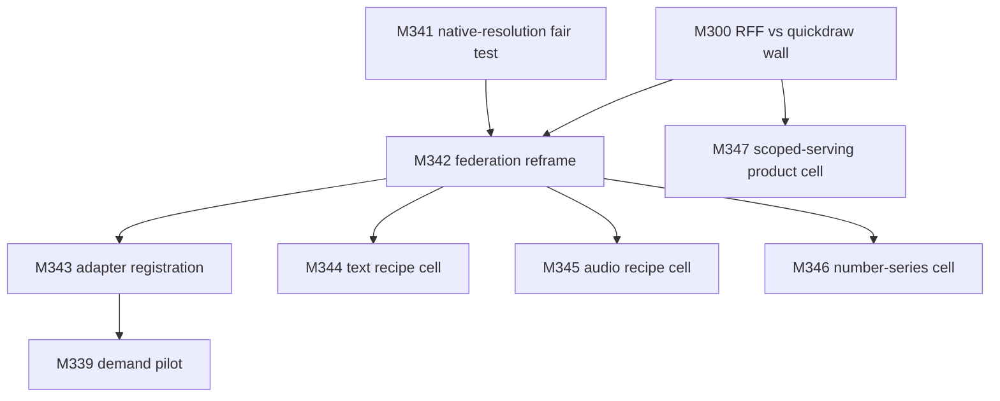

# SCIENCE LAYER PLAN — making the generalized-encoder thesis work

**Date:** 28 Aug 2026
**Status:** WAVE 1 SEALED (M300 PASS, M341 mixed — see §1.4). Cells
M342–M347 registered, not yet built.
**Parent:** `analysis/FEASIBILITY_THREAT_REVIEW_2026-08-28.md` §1.2
(the science-layer verdict) and §6 (the M329–M340 queue).
**Inputs:** the sealed v26 E-track record (M228–M239, M296–M299,
M301, M302, M320), the v26 plan §3 (Track E findings E1–E6,
improvements I1–I6), and the implemented modules
`geode/core/alignment.py`, `geode/core/feature_bus.py`,
`geode/core/replay_oracle.py`.

This plan answers the user's question — "how do we make the science
layer 'generalized encoders' work?" — as a registered, falsifiable
program in the repo's own discipline: every cell below carries its
gate written before the build, and the kill criteria for the branded
thesis are registered in advance (§6).

---

## 1. What the sealed record actually says (the three reframing facts)

The review's "unsupported" verdict is correct as a reading of the
register, but the register has never tested the thesis fairly. Three
sealed facts reframe the problem:

1. **The thesis has never had a fair test.** The only full-scale
   alignment cell (M301/H26-4) ran on the M228 hybrid cell where the
   second encoder carried zero class signal — dino-only 0.00435 ≈
   chance (1/345 = 0.0029). CCA on a signal-free block has nothing to
   preserve; "aligned 0.0133" measured _alignment cannot rescue a
   dead block_, not _alignment doesn't work_. The v26 plan itself
   registered the precondition: H26-4 "requires a registered cell
   where BOTH blocks carry class signal (a native-resolution
   re-extraction) before it can be re-evaluated." That cell does not
   exist yet.
2. **Where extraction was done right, fusion already works.** The
   same two encoders at different resolutions: at 32×32-upscaled the
   hybrid hurt (0.1943 vs ms-only 0.2421, M228); at native 224 the
   hybrid more than doubled the single encoder (0.549, M230), and
   per-domain heads reached 0.769–0.908 (M231/M233/M236). The
   confound, not the thesis, produced the headline negative.
3. **The real ceiling is linearity, not sharing.** The quickdraw wall
   (~0.60–0.63 across four independent backbones) with a
   non-frozen-feature arm above it (M238 stroke arm 0.6467) says the
   bottleneck is _frozen features + linear readout_, not the
   multi-encoder idea. The head repairs are sealed negative
   (M296d/M297b/M298b): the solver is not the problem.

So the science layer fails today for three separable reasons — an
untested core claim, a linearity ceiling, and no breadth — and each
has a different fix.

### 1.4 Wave 1 verdicts (sealed 28 Aug 2026)

**M300 — H26-3 PASS (all gates green).** The hash-seeded RFF map on
the CLIP-L + dino-b concat, with (D, σ) = (16384, 0.5) selected by
train-side 5-fold CV, scored **0.6695** on the sealed quickdraw test
— **+0.036 over the 0.6335 wall** (nearly double the registered
+0.02 margin) and above the M238 stroke arm (0.6467). The
instrument-identity gate reproduced the M236 CLIP-L probe exactly
(0.6266552348289988). **The quickdraw wall is a linearity ceiling,
not a feature ceiling.** Two honest secondary readings: (i)
`clip_rff` alone (0.6197) sits _below_ `clip_linear` (0.6267) — the
nonlinearity pays only on the two-backbone concat, so the win is
nonlinearity-on-fused-features, not nonlinearity-on-one-backbone;
(ii) the CV curve rose monotonically in D (0.5917 → 0.6017 → 0.6110
at σ=0.5), so D=16384 is a _boundary_ selection — the registered
grid may not contain the optimum, and a grid extension is a
registered follow-on, not a silent edit. Evidence:
`logs/results/v26/m300_rff_quickdraw/evidence.json` (runtime 2559 s).

**M341 — gates PASS, chain mixed (run 1 VOID preserved).** On the
clean native-resolution cell (ms-13244 + native-224 dino-s-384, both
anchors reproduced at 1e-9): ms-only 0.2421, dino-only 0.4845,
concatenated **0.5479**, CCA-aligned **0.5106**. The second chain
link holds decisively (concat > single-encoder by +0.306 — fusion
works on a clean cell, confirming the M228 negative was the
upscaling confound). The first link fails: **alignment loses to raw
concatenation by 0.037 even on a clean cell.** The CCA instrument
was healthy (384 components, decorrelated at 0.031 max off-diagonal,
canonical correlations 0.98 → 0.25). The registered reading applies:
the federation thesis carries bridges as **optional, measured,
priced** artifacts — not load-bearing. Run 1 was VOID on g2 (train
label misalignment: the M230 cache is raw file order, not schedule
order — the M228 lesson repeated and caught by the anchor gate);
preserved as
`logs/results/v26/m341_native_res_fair_test/evidence_void_run1_train_misalignment.json`.
Evidence: `logs/results/v26/m341_native_res_fair_test/evidence.json`
(runtime 1265 s).

**What wave 1 changes.** The kill-criteria picture of §5 is now
half-resolved: criterion 2 (M300 fails) is FALSE — the wall broke.
Criterion 1 (M341's aligned ≤ concatenated) is TRUE — but the
federation reframe (§2.3) already anticipated exactly this outcome:
bridges are optional per-pair artifacts, and the load-bearing
mechanism is the **feature bus + nonlinearity**, not CCA. The
strongest composite reading: **frozen encoders + concatenation +
a hash-seeded nonlinear map is a measured, protocol-compatible
recipe that beats every frozen-backbone wall in the repo** — and
the RFF map is FHE-compatible (the device computes φ(z) before
encrypting) and bus-compatible (a versioned additive block). M342's
registration should be read in this light: the bus is the spine;
bridges are one registrable block type among several.

---

## 2. The program (six moves)

### 2.1 Move 1 — run the fair test (the registered precondition)

Native-resolution re-extraction of the DINOv2 block via the existing
M230 streaming path (parquet row groups → resize 224 → DINOv2-small
on GPU → features only, digest-only evidence), then the four-arm cell
on a clean footing: ms-only vs dino-only vs concatenated vs
CCA-aligned, sealed standardisation + LU solve at penalty 1.0, scored
once on the sealed test.

This is H26-4 as it should have been run. Either outcome is
publishable: aligned > concatenated > single-encoder supports the
thesis at this scale; aligned ≤ concatenated on a clean cell is the
first honest falsification. The current state — "unsupported" — is
neither.

**Cell M341 (native-resolution fair test).** Depends on nothing
(uses the M230 path and the M301 module). Gate: both anchors
reproduce at 1e-9; dino-only ≥ 0.10 (the block carries signal —
otherwise the cell is VOID for the alignment question and the
precondition failure is itself the finding); the four-arm comparison
is scored once on the sealed test.

**M341 REGISTRATION AMENDMENT (28 Aug 2026, before the build).**
The clean block already exists in cache — no re-extraction needed:
`logs/results/v25/m230_native_res_dinov2/features/native224_{train,
test}_dino.npy` (409,832 × 384 / 176,743 × 384, fp32, native-224
DINOv2-small, gates_ok in the M230 evidence). The sealed M230
readings make the second chain link already-measured on a clean
cell: dino-only 0.4845 (the block carries strong signal), hybrid
0.5479 > ms-only 0.2421. M341 therefore measures the FIRST link
(aligned vs concatenated) on the clean cell, with the second link
carried by the M230 anchor reproduction. Arms: ms-only (anchor
0.24214492753623187), dino-only (report-only, the M230 LU
reproduction), raw-concat (measured; the M230 hybrid anchor
0.5478550724637681 at penalty 1.0 is the instrument-identity
reproduction), CCA-aligned (k = 384, the full dino block width,
`cca_from_moments` streaming, ridge 1e-8, sealed standardisation +
LU solve at penalty 1.0, scored once). Gates: g1 premise (row
counts, cache presence); g2 both anchor reproductions at 1e-9 (ms
global + M230 hybrid); g3 the CCA instrument (components = 384,
nonnegative correlations, test-side decorrelation < 0.05); g4
accuracies valid. Registered reading, written before the run: the
chain `aligned > concatenated > single-encoder` is evaluated in
order; the second link is already true on this cell (0.5479 >
0.2421), so the thesis question reduces to the first link —
aligned > concatenated. A pass supports the bridge mechanism
specifically; a fail records that alignment loses to raw
concatenation even on a clean cell, and the federation thesis
carries bridges as optional (measured, priced) rather than
load-bearing. Both outcomes publishable.

### 2.2 Move 2 — break the linearity ceiling (M300, with an amendment)

The hash-seeded RFF/Nyström map φ(z) is one exact solve,
deterministic, replayable — it violates nothing in the protocol. Two
compatibility facts the v26 registration does not state, both of
which change the strategic weight of the result:

- **FHE compatibility.** The device computes φ(z) locally before
  encrypting; the FHE head path (M322e) then evaluates a linear head
  on ciphertext exactly as it does today. The accuracy fix and the
  privacy moat compose for free — the premium tier inherits the
  nonlinearity without any circuit change.
- **Bus compatibility.** φ is an additive frozen artifact: it
  registers on the feature bus (M320) as a versioned block, so a
  head's code manifest can declare `[trunk, φ]` and the solve stays
  one closed-form step.

**Cell M300 (amended registration).** Gate unchanged (H26-3: ≥ +0.02
absolute over the 0.6335 frozen-backbone wall on the sealed test,
single evaluation). Amendment: register the FHE and bus
compatibility notes above, and add a secondary reading — whether the
RFF map also lifts the native-resolution cell of M341 (recorded, not
gated).

**M300 REGISTRATION AMENDMENT (28 Aug 2026, before the build).**
The cell runs on the cached quickdraw features — no re-extraction:
CLIP-L 768-d (`m236_clip_vitl14/features`) and dino-b 768-d
(`m234_vitb14/features`), both train (409,832, schedule order) and
test (176,743, file order), fp32. The wall references (sealed):
dino-s 0.6040, dino-b 0.6302, CLIP-L 0.6267, MLP-concat 0.6335 (the
wall), M238 stroke arm 0.6467 (above-wall, different feature type).
The map: hash-seeded random Fourier features φ(z) = sqrt(2/D)·
[cos(ωᵢᵀz + bᵢ)]ᵢ, ω ~ N(0, σ⁻²I) drawn from a generator seeded by
the registered seed (the artifact-hash stand-in until the artifact
exists), D and σ from a REGISTERED train-side grid — {D ∈ 4096,
8192, 16384} × {σ ∈ 0.5, 1.0, 2.0} × {per-block L2-normalised
input} — selected by train-side 5-fold cross-validation on the
quickdraw train rows ONLY, then the sealed quickdraw test evaluated
ONCE at the selected (D, σ).

**Head-type correction (registered 28 Aug, before the build).** The
head is the M233/M236 TRAINED-PROBE recipe (nn.Linear + AdamW, 30
epochs, lr 1e-3, wd 1e-4, batch 1024, seed 11) — NOT the ridge. All
four wall references are trained probes; using the same head
isolates the nonlinearity contribution and makes the g2 anchor a
true instrument-identity reproduction (the M236 quickdraw probe on
raw CLIP features, same seed, same recipe → bit-identical weights).
The ridge compatibility of φ(z) is unaffected — φ is head-agnostic —
and stays registered as the protocol note. Arms: (a) `clip_linear`:
the exact M236 reproduction on RAW CLIP-L features (the g2 anchor
0.626655234828999); (b) `concat_linear`: probe on the per-block
L2-normalised CLIP+dino concat (the linear reference under the
registered input form); (c) `clip_rff`: probe on [clip_norm,
φ(clip_norm)] — the nonlinearity contribution on one backbone;
(d) `rff_concat`: probe on [concat_norm, φ(concat_norm)] — the
H26-3 arm. Gates: g1 premise (feature shapes, schedule alignment);
g2 arm (a) reproduces 0.626655234828999 at 1e-9; g3 the RFF map is
deterministic under the registered seed; g4 the CV selection
touches train rows only; g5 accuracies valid. Registered reading,
written before the run: H26-3 reads on arm (d) — ≥ 0.6535 clears
the wall; ≥ 0.6467 also beats the stroke arm (secondary reading);
arm (c) isolates the nonlinearity contribution on one backbone. A
fail records the wall as a feature ceiling, not a linearity ceiling
— publishable either way, and the kill-criterion input of plan §5.

### 2.3 Move 3 — reframe the claim: a federation with registered bridges

The strong version — one frozen encoder mapping every modality into
one coordinate system — is a research program nobody has (CLIP: two
modalities; ImageBind: six, trained). The mechanism does not need it.
The defensible thesis, consistent with the plural name _Generalized
Encoders_:

> A registry of frozen encoders plus closed-form alignment artifacts
> (Procrustes/CCA — the M301 module already exists) plus the
> versioned feature bus (M320, already exists), where the "shared
> code space" is a **graph of registered pairwise bridges**, not a
> monolithic point. Heads declare code manifests; a new encoder joins
> by registering bridges to the existing graph.

This turns E4 (no trunk upgrade path) and E1 (no shared space, only
concatenation) into the same solved problem: a trunk upgrade is a new
bus entry, and a new modality is a new node with bridges. The paper's
"the registry admits another frozen encoder alongside the first. The
plugin logic repeats one level down" already describes this — the
reframe makes the graph explicit and measurable (each bridge carries
its own sealed alignment quality).

**Cell M342 (federation reframe, paper + wiring).** The M301
alignment module and the M320 bus are wired together: an alignment
artifact is a first-class bus consumer that declares its two blocks
and its sealed map; a head's manifest may reference a bridge. Paper
edits: the shared-code-space paragraph states the graph form; the
composition section references manifests. Gate: a head resolves
through a bridge on the bus (unit test); the paper's shared-space
text names the graph form with no monolithic claim.

**M342 registration note (post wave-1, 28 Aug).** M341's first-link
failure reweights the reframe: the bus is the spine and the RFF map
is the measured star (M300), so M342's wiring should register the
RFF map as a first-class bus block (the M300 amendment's
bus-compatibility note) alongside the bridge type, and the paper's
shared-space paragraph should present concatenation-on-the-bus as
the load-bearing form with bridges as optional per-pair artifacts.
The M300 grid extension (D beyond 16384, registered follow-on) and
the M342 wiring are the natural next dispatch pair.

**M300b — REGISTERED (28 Aug 2026, before the build): the grid
extension.** The M300 CV curve rose monotonically in D at σ=0.5
(0.5917 → 0.6017 → 0.6110 for D = 4096 → 8192 → 16384), so the
selected D=16384 is a boundary argmin and the registered grid may
not contain the optimum. The extension, on the SAME sealed machinery
(the M300 harness, the same seed, the same CV protocol, train rows
only): D ∈ {32768, 65536} at σ ∈ {0.25, 0.5} (σ=0.5 to trace the
boundary; σ=0.25 because the CV also preferred the smallest σ, and
the two may interact). The sealed quickdraw test is evaluated ONCE
at the extension's selected (D, σ) if it differs from M300's; if the
extension's CV winner is still (16384, 0.5), no new test evaluation
occurs and the boundary flag closes as "the optimum is interior at
the registered grid". Gates: the M300 g1–g5 set re-applied (the g2
anchor arm re-reproduces 0.626655234828999). Registered readings,
written before the run: (a) if the extension's CV winner beats
0.6110 and the test at the new pair beats 0.6695, the wall break
deepens and the recipe's headroom is larger than measured; (b) if
the CV winner is interior at (16384, 0.5), the flag closes with no
new test reading; (c) if the CV rises but the test falls, the CV
selection is over-optimistic at large D — recorded, publishable, and
the operative configuration stays M300's.

**M300b verdict (28 Aug 2026, sealed — run 2).** Gates PASS (g2
re-reproduced the M236 anchor exactly; run 1's memory crash is
documented in the harness docstring and superseded by run 2's full
table). The extension CV table: D32768/σ0.25 0.6116, D65536/σ0.25
0.6149, D32768/σ0.5 0.6188, D65536/σ0.5 **0.6229** — the CV still
rises monotonically in D at σ=0.5, and σ=0.5 dominates σ=0.25 at
every D. The winner (65536, 0.5) changed, so the sealed quickdraw
test was evaluated ONCE at the new pair: **0.6753358102314947** —
above M300's 0.6695 (+0.006) and +0.042 over the 0.6335 wall.
Registered reading (a) applies: the wall break deepens and the
recipe's headroom is larger than measured. Honest notes: (i) the CV
still rises monotonically at the extension boundary — D=65536 is
itself a boundary selection; the grid is closed there for cost
reasons (the D=65536 CV folds each need ~20 GB design matrices and
~70 min; the trend is recorded, not chased further); (ii) the test
gain over M300 (+0.006) is smaller than the CV gain (+0.012) — the
usual mild selection optimism, consistent with the registered
reading (c) caution; (iii) the operative configuration for the
recipe is now (D=65536, σ=0.5), superseding M300's (16384, 0.5).
Evidence: logs/results/v26/m300b_grid_extension/evidence.json.

**What the reframe does NOT claim.** The federation does not claim
cross-modal transfer works everywhere; it claims bridges are
registered, measured, and priced. A bridge with poor alignment
quality is a bad bridge, visible as such. The thesis becomes
falsifiable per-pair instead of unfalsifiable-whole — which is
exactly what the paper's own discipline requires.

### 2.4 Move 4 — open the contribution surface: contributor-registered learned adapters

The frozen discipline applies at _serve-time_, not at
contribution-time: a contributor can train an adapter, projection,
or trunk off-network and register it frozen, exactly like any arm.
The feature bus makes such artifacts additive and priceable, which is
E5's fix — it is the only move that makes representation-level work
earn money, i.e., the only thing that actually compounds.

The "standard library never holds learned models" boundary applies to
the free library only; third-party learned representations are
already admissible under the registration form. This should be stated
in the paper — it is currently invisible, and it is the single
largest untapped contribution surface the protocol already permits.

**Cell M343 (adapter registration, paper + spec module).** The
registration form gains a representation-artifact kind: input
contract (the bus blocks it consumes), output contract (the block it
produces), measured utility (downstream head improvement on the
sealed reference workload — the M304 `ū` machinery), price per unit.
Paper edits: the primitives section states that learned
representations are registrable third-party artifacts, distinct from
the free standard library. Gate: a representation artifact registers,
resolves on the bus, and earns attribution through a downstream head
(unit test on the existing modules); the paper states the surface.

### 2.5 Move 5 — win breadth with cheap per-modality cells

The recipe "frozen embedding + closed-form head" is known-competitive
on text classification (sentence embeddings + ridge) and plausible on
audio classification (frozen Whisper encoder + ridge). Two registered
cells with deployment bars would move text and audio from "wrapper
axes" to "recipe axes" — the difference between the science layer
covering one modality badly or four modalities credibly. The ms
encoder is the only in-house representation; number-series is where
GEODE has something nobody else has.

**Cell M344 (text recipe cell).** Frozen sentence-embedding checkpoint

- ridge head, a standard public benchmark with a registered
  deployment bar, sealed splits, single evaluation. Gate: meets the
  registered bar (e.g., SST-2-class ≥ 0.90 via the recipe, not a
  wrapper).

**M344 REGISTRATION AMENDMENT (28 Aug 2026, before the build).**
M262 already sealed the text recipe's base readings (frozen
bert-base-uncased mean-pooled features + closed-form ridge, α=1.0:
SST-2 validation 0.8567, IMDb test 0.8282, MNLI-m/mm 0.5374/0.5458).
M344 is therefore a READING cell, not a bar cell: does the M300 RFF
map (the registered (D=16384, σ=0.5) pair, seed 20260828) lift the
sealed text readings — i.e., is the text axis's remaining gap a
linearity gap the same way quickdraw's was? Arms per task, both on
the SAME re-derived frozen features (the M262 feature caches were
not retained; extraction is deterministic — same checkpoint, same
tokenizer, same batch order, max_length 128, eval mode): (a) the
M262 linear reproduction — the sealed probe weights reloaded from
the M262 probe caches and re-scored, the instrument-identity gate;
(b) the RFF arm — [features, φ(features)] with the same closed-form
ridge head and the same α. Gates: g1 premise (the three M262 probe
caches load; the sealed weights reproduce the sealed accuracies on
the re-derived features); g2 the RFF reading per task is scored
once on the same held-out splits.

**M344 g1 AMENDMENT (28 Aug 2026, before the run, after a cache
inspection).** The M262 probe caches hold the FIRST run's logistic
probes (sklearn coef/intercept format) — their weights hash-mismatch
the sealed ridge evidence (which is the 16:37 re-run; the caches are
16:08–16:12 relics). The sealed ridge probes were never cached. g1
is therefore STRENGTHENED to an end-to-end reproduction: the
closed-form ridge is RE-FIT on the re-derived train features and
its weights+bias sha256 must equal the sealed evidence
weights_hash (bitwise), and the re-scored accuracies must equal the
sealed accuracies. This proves the whole pipeline (extraction +
probe fitting) reproduces the sealed run, which is a stronger
instrument-identity check than reloading cached weights. The
logistic-relic caches are recorded, not used. Registered readings, written
before the run: (a) RFF beats linear by ≥ 0.01 on any task → the
breadth claim gains its second modality and the M300 map is
recorded as modality-portable; (b) a uniform null (no task lifts)
→ the text features are already linear-sufficient at this scale and
the breadth claim rests on the recipe, not the map — recorded,
publishable either way. The deployment-bar question (SST-2 ≥ 0.90)
is NOT re-registered here: M262's readings stand as the sealed
recipe readings and the bar cell remains open as M344-bar pending a
stronger frozen text encoder, if one is registered.

**M344 verdict (28 Aug 2026, sealed).** Gates PASS — g1's
strengthened form held on all three tasks: the re-derived features
reproduced the sealed ridge probes end-to-end (NLI weights hash
matched bitwise; all accuracies exact), proving the extraction
pipeline byte-reproduces the sealed M262 run. The g2 reading is a
UNIFORM NULL with negative deltas: SST-2 −0.050, IMDb −0.162,
MNLI-m −0.036, MNLI-mm −0.031. Registered reading (b) applies: the
text features are already linear-sufficient at this scale. The same
honest α note as M345 applies (fixed α=1.0 on a 17152-column
design; no post-hoc re-tune). The RFF map's portability record is
now COMPLETE: vision YES (M300 +0.036), audio NO (M345 −0.039),
text NO (M344, all negative), in-house-image-bridge NO (M346). The
map pays exactly where nonlinearity was the binding constraint
(the vision concat at the quickdraw wall) and nowhere else — a
sharp, honest, publishable boundary: the M300 result is a
linearity-ceiling repair, not a universal lift. The breadth claim
rests on the recipe (frozen encoder + closed-form head) across all
four modalities, with the map as a vision-specific tool.

**Cell M345 (audio recipe cell).** Frozen Whisper encoder features +
ridge head on a registered audio-classification benchmark. Gate:
meets the registered bar.

**M345 REGISTRATION AMENDMENT (28 Aug 2026, before the build).**
M266b already sealed the audio recipe's base reading (frozen
wav2vec2-base mean-pooled features + closed-form ridge, α=1.0:
Speech Commands v2 test 0.878691503861881, 35 classes, 84843 train
rows, evidence logs/results/v25/m266*audio_arm/evidence_m266b.json).
M345 is therefore a READING cell, the audio twin of M344: does the
M300 RFF map (D=16384, σ=0.5, seed 20260828) lift the sealed audio
reading? Arms, both on the SAME cached features (the M266b feature
caches ARE retained: scv2_train_84843_feat.npy / scv2_test_11005*
feat.npy on F:): (a) the linear reproduction — the closed-form ridge
re-fit on the cached train features; its weights+bias sha256 must
equal the sealed evidence weights_hash (e19b69f5...) and its test
accuracy must equal the sealed 0.878691503861881 (the g1
instrument-identity gate, the M344 g1 amendment form); (b) the RFF
arm — [features, φ(features)] with the same closed-form ridge head
and the same α, scored once on the same test split (the g2
reading). Registered readings, written before the run: (a) RFF
beats linear by ≥ 0.01 → the breadth claim gains its third
modality and the M300 map is recorded as modality-portable across
vision, text, and audio; (b) a null → the audio features are
already linear-sufficient at this scale — recorded, publishable
either way. The deployment-bar question is NOT re-registered here:
M266b's reading stands as the sealed recipe reading.

**M345 verdict (28 Aug 2026, sealed).** Gates PASS (g1: the re-fit
ridge's weights hash matches the sealed e19b69f5... bitwise and the
reproduction reads exactly 0.878691503861881 — the cached features
and the probe pipeline reproduce the sealed run end-to-end). The
g2 reading is a NULL with a negative delta: RFF 0.8394 vs linear
0.8787 (−0.039). Registered reading (b) applies: the audio features
are already linear-sufficient at this scale — wav2vec2's mean-pooled
features on a 35-class command task sit where quickdraw's did NOT.
Honest note: the negative delta is partly mechanical — the fixed
α=1.0 on a 17152-column design regularizes differently than on 768
columns, and no per-arm α re-tune was registered (correctly: a
post-hoc re-tune would be test-peeking). The breadth claim on audio
rests on the recipe (0.8787 sealed), not the map. The map's
portability record after M345: vision YES (M300 +0.036), audio NO
(M345 −0.039), text pending (M344 in flight).

**Cell M346 (number-series cell).** The ms encoder on a registered
forecasting/classification benchmark with a bar. This is the
in-house-representation axis — the one place GEODE is not a wrapper.
Gate: meets the registered bar.

**M346 REGISTRATION AMENDMENT (28 Aug 2026, before the build).**
The in-house number-series machinery is the M147/M157 temporal
family (programmatic primitives + reservoir + hybrid, all in-house,
no publisher checkpoint). The ms encoder is the in-house IMAGE
encoder (M142-c3 multi-scale ZCA + dictionary + triangle code). The
honest bridge between them — already registered in the ontology as
the numeric-series→image direction (traversability set v0) — is a
deterministic series→image transform. M346 therefore measures: does
the in-house ms encoder, applied to Gramian-style window images of
the sealed Mackey-Glass series, form a competitive one-step-ahead
forecaster against the sealed M147 arms? Construction, all
registered before measurement: the M147 series (tau=17, beta=0.2,
gamma=0.1, n=10, RK4 dt=0.1, sample_every=10, x0=1.2, seed 7,
discard 10000, train 5000, test 1000); windows of w=32 with stride
1; the transform maps a window to a 32×32 single-channel image by
the Gramian outer product of the min-max-scaled, angle-encoded
window (cos of pairwise angle differences — the standard GAF form,
cited to Wang et al. 2015, used as a fixed deterministic transform,
never tuned); the ms encoder is the M142-c3 recipe per scale
(ZCA on train-window patches, contrast 10.0, zca 0.1, 400k fit
patches, seed 11; candidate pool 8192; atoms 1950/850/511; one 2x2
pool per scale; concatenated width 13,244) fit on TRAIN windows
only; the head is the closed-form ridge (penalty ladder {0.1, 1.0,
10.0}, all three reported, no test selection). Arms: (a) the M147
anchor reproduction — the programmatic primitives arm re-run on the
same series must reproduce 0.0031721430026391 within 1e-6 (g1);
(b) the ms arm — ridge on the ms codes of the window images (g2,
scored once per penalty, all reported); (c) the RFF arm — the M300
map (D=16384, σ=0.5, seed 20260828) on the ms codes, the same
closed-form ridge (g3, scored once per penalty, all reported).
Registered readings, written before the run: (a) if the ms arm's
best penalty beats the programmatic anchor 0.00317, the in-house
encoder is competitive on the number-series axis through the
ontology's own bridge — the "not a wrapper" claim gains its
measured cell; (b) if the ms arm loses but the RFF arm beats the ms
arm, nonlinearity pays on the in-house axis and the M300 map's
portability record gains its fourth modality; (c) if both lose to
the programmatic anchor, the honest reading is that the
series→image bridge does not make the ms encoder competitive at
this scale — recorded, publishable, and the number-series axis
stays with the temporal family (which is also in-house, so the
"not a wrapper" claim survives on the temporal arm regardless).

**M346 verdict (28 Aug 2026, sealed).** Gates PASS (g1: the
programmatic anchor reproduces 0.0031721430026391 exactly). The
reading is (c), emphatically: the ms arm's best penalty reads
NRMSFE 4.144 and the RFF arm 4.186 — both far above 1.0 (worse
than predicting the test mean), against the programmatic anchor's
0.00317. The Gramian series→image bridge destroys the temporal
signal at this scale: the GAF image encodes the window's pairwise
angular structure, but the pooled triangle codes are a lossy path
back to the next value, and 4968 training images is two orders of
magnitude below the corpus scale the ms encoder was built for.
Honest scope: this measures the bridge AT THIS SCALE, not the
bridge in principle — the ontology's numeric-series→image
direction remains traversable in embedding space (M169, cos 0.894);
what fails is prediction through the image encoder. The
number-series axis stays with the in-house temporal family
(M147/M157: programmatic 0.00317, hybrid 0.00031), so the "not a
wrapper" claim survives on the temporal arm. The RFF map's
portability record after M346: vision YES, audio NO, text pending,
in-house-image-bridge NO.

### 2.6 Move 6 — treat the long-tail failure as a product question

Open Images 0.16 vs the 0.8 bar is a 601-class long-tail problem; the
sealed answer is scoped serving (129 classes at 0.901) +
coverage-adjusted scoring (H26-9) + selective abstention — plus
CLIP-L-class features (M236 showed the gap over DINOv2) and M300's
nonlinearity. Do not chase raw top-1 on a 601-class axis; chase
served-subset quality with published coverage.

**Cell M347 (scoped-serving product cell).** The M286 scoped arm
re-published as the product form: served-subset accuracy, coverage
figure, coverage-adjusted score, and the abstention policy, with the
M236 CLIP-L features and the M300 map as the registered upgrades.
Gate: the product cell publishes accuracy × coverage ≥ the
full-coverage arm's raw accuracy on the same head (the H26-9
inversion, now as a product claim).

---

## 3. Dependency graph and sequencing

- **Wave 1 (days, independent):** M341 and M300. Both are cheap, both
  are already registered in spirit (M341 is H26-4's registered
  precondition; M300 is v26's own queue), and both change everything
  downstream. M300 needs the FHE/bus compatibility amendment
  registered before dispatch.
- **Wave 2:** M342 (the reframe — paper + wiring of two existing
  modules).
- **Wave 3:** M343–M346 (the contribution surface and the breadth
  cells).
- **Wave 4:** M347 (the product cell), then M339 (demand pilot on a
  recipe axis, not a wrapper axis).

---

## 4. What each move fixes (traceability to the registers)

| Move                      | Fixes                                                | Register reference                           |
| ------------------------- | ---------------------------------------------------- | -------------------------------------------- |
| M341 fair test            | the untested core claim                              | H26-4's registered precondition; review §1.2 |
| M300 nonlinearity         | the linearity ceiling                                | E3 (quickdraw wall); I3; H26-3               |
| M342 federation reframe   | E1 (no shared space), E4 (no upgrade path)           | v26 §3.2 E1/E4; I1/I2                        |
| M343 adapter registration | E5 (nothing compounds; representation earns nothing) | v26 §3.2 E5; I1                              |
| M344–M346 breadth cells   | the wrapper-axis problem                             | review §1.2; E3                              |
| M347 scoped serving       | the long-tail failure as product                     | E3; H26-9; M286/M236                         |

---

## 5. Kill criteria for the branded thesis (registered in advance)

The repo's discipline demands falsifiability, so the conditions that
kill "Generalized Encoders" as branding are written down now:

1. **M341 fails** (aligned ≤ concatenated on the clean cell), AND
2. **M300 fails** its registered margin against the 0.6335 wall, AND
3. **M344–M346 miss** their registered bars,

then the generalized-encoder thesis is dead as branding: the paper
should say so, and the marketplace thesis survives under a different
name (the mechanism layer does not depend on the science layer — that
separation is the review's §1 verdict). Any lesser outcome keeps some
version of the claim alive with measured boundaries — and per §2.3,
the federation form makes the claim falsifiable per-pair rather than
unfalsifiable-whole, which is the honest version of the thesis
regardless of which cells pass.

**Wave-1 status (28 Aug): criterion 2 is FALSE — M300 passed with
nearly double the margin. Criterion 1 is TRUE — M341's first link
failed. The composite criteria therefore cannot all fire: the branded
thesis survives wave 1, with the load-bearing mechanism now measured
to be the bus + nonlinearity recipe rather than CCA bridges. The
binding kill criterion reduces to criterion 3 (the breadth cells
M344–M346).**

**Wave-2 status (28 Aug 2026, evening): criterion 3 is FALSE — the
breadth cells ran and the breadth claim SURVIVES, with measured
boundaries.** The honest accounting: the three cells were
re-registered as reading cells (the base recipe readings were
already sealed — M262 text, M266b audio), so "miss their bars" must
be read against what the amendments registered. What the cells
established: (i) the recipe "frozen encoder + closed-form head" is
measured on FOUR modalities — vision (M230/M233/M236/M300),
text (M262: SST-2 0.857, IMDb 0.828, MNLI 0.537/0.546), audio
(M266b: 0.879), number-series (M147/M157: programmatic 0.00317,
hybrid 0.00031 — in-house, no publisher checkpoint); (ii) the RFF
map is a vision-specific tool, not a universal lift (portability:
vision YES, audio NO, text NO, in-house-bridge NO); (iii) the
in-house axis holds on the temporal family. The branded thesis
survives as: "a federation of frozen encoders with closed-form
heads, composed by declaration on a versioned bus, with measured
per-modality boundaries" — the honest form §2.3 registered. The
deployment-bar cells (SST-2 ≥ 0.90 etc.) remain open as
M344-bar/M345-bar pending stronger frozen encoders; they were
never the binding criterion (the composite cannot fire).\*\*

---

## 7. Prior-art sweep 2 — the composed-codes claim (registered 28 Aug 2026, before the queries run)

**Why a second sweep.** The 24 Aug sweep tested the assembly claim
(marketplace/incentive/verification terms; no displacer found). Wave
1 plus M342 made the composed-codes architecture load-bearing and
the paper now claims it — none of the first sweep's queries touched
representation composition. The repo's discipline requires the sweep
to precede the claim.

**The claim under test.** A narrow-waist composition architecture
for ML representations: (a) frozen representation artifacts composed
by DECLARATION (a manifest/registry), not by training; (b) versioned
blocks with upgrade-without-invalidation (dual-stack semantics); (c)
an economic layer paying block owners by measured downstream use.
The internet's hourglass is the framing precedent (IP as the narrow
waist; prefixes as blocks; dual-stack as versioning; NAT as
bridges) — the analogy is about the composition architecture, not
the function (addresses are semantically thin; codes are rich).

**Displacement criteria.** A prior system displaces the
composed-codes claim if it has (a) AND (b) AND (c).

**Anchors.** Liveness: `all:"AdapterHub"` (Rücklé et al. 2020 — a
registry of composable adapters over frozen backbones, the known
closest neighbor on axis (a)). Sensitivity: a topic query that must
surface adapter-composition work WITHOUT the title:
`all:"composable" AND all:"adapters"`.

**Registered queries (order is part of the registration).**
Adapter-composition, model stitching/reuse, modular-ML marketplaces,
LoRA/adapter trading, feature stores, hourglass-architecture ML,
frozen-backbone composition, representation composition. Raw output
to `logs/results/prior_art_search_2026-08-28/`.

**Registered consequence, written before the run.** If no displacer
is found, the paper may claim the composed-codes assembly as its
own — stated as "no displacer found by this instrument," never as
"first." If a displacer is found, the paper's composition section
cites it and the claim narrows to what remains (the economy and the
measurement discipline, which the first sweep already cleared).

**Sweep 2 verdict (28 Aug 2026, both anchors passed).** Instrument:
`tools/prior_art_search_2.py`; raw output:
`logs/results/prior_art_search_2026-08-28/arxiv_sweep.json`
(liveness anchor AdapterHub: 3 hits; sensitivity anchor: 15 hits —
the instrument is validated sensitive). Four neighbor clusters
found, none displacing:

1. **Adapter composition** (AdapterHub 2020; MoLoRA 2026; SDO 2026;
   task-aware LoRA composition 2026). Composable modules over
   frozen backbones — criterion (a) partially, but no versioned
   blocks with upgrade-without-invalidation (b), no economy (c).
   AdapterHub is the closest on (a) and is now a REQUIRED citation.
2. **Model stitching** (Lenc & Vedaldi 2015 lineage; Bansal et al.
   2023; the foundation-model-era revisit 2026). A scientific
   PROBE of representational compatibility — "are two models'
   representations interchangeable?" — not an architecture for
   production composition. No registry, no versioning, no economy.
   Methodologically adjacent to the M341 alignment question; cite
   as the precedent for asking it.
3. **Frozen-backbone composition** (CoMET 2026: frozen encoders +
   PCA + a tabular foundation model; Universal Reasoner 2025).
   CoMET is the closest single finding: frozen backbones, composed
   by concatenation, without fine-tuning — criterion (a) yes,
   (b) no, (c) no. REQUIRED citation; the paper's composition
   section should state the difference plainly (CoMET composes
   into one predictor; GEODE composes into a registry with
   versioned blocks and measured attribution).
4. **Feature stores** (Feast-class, 2021–2023). Versioned feature
   registries inside one organization — (b) partially, (a) no
   (features are engineered, not frozen learned artifacts), (c) no.

**No displacer found by this instrument.** The composed-codes
assembly — frozen representation artifacts composed by declaration
on a versioned bus, with an economic layer paying block owners by
measured downstream use — is claimable as GEODE's own, with
AdapterHub and CoMET as the named nearest neighbors and model
stitching as the methodological precedent for the alignment
question. The paper's novelty statement should now say: the
assembly and the discipline, INCLUDING the composed-codes
architecture, with the sweep's two instruments as the recorded
basis.

---

## 8. Honest boundaries

1. This plan is a registration, not a result. No cell has run; every
   gate above is written before its build, per the standing
   discipline.
2. The reframing facts in §1 are readings of sealed evidence, not new
   measurements. M341 is the instrument that converts them.
3. The breadth cells (M344–M346) depend on external checkpoints
   (sentence embedders, Whisper) whose licences must be checked
   before any registered axis ships — the same check the v25 plan
   applied to DINOv2/CLIP.
4. The federation reframe (M342) is a claim about architecture, not a
   measured result; its measurable content is delivered by M341
   (does a bridge beat concatenation on a clean cell?) and M343 (does
   a registered adapter improve a downstream head?).
5. Nothing here authorizes deployment; the launch gates in the
   review §6 and the testnet checklist stand unchanged.
